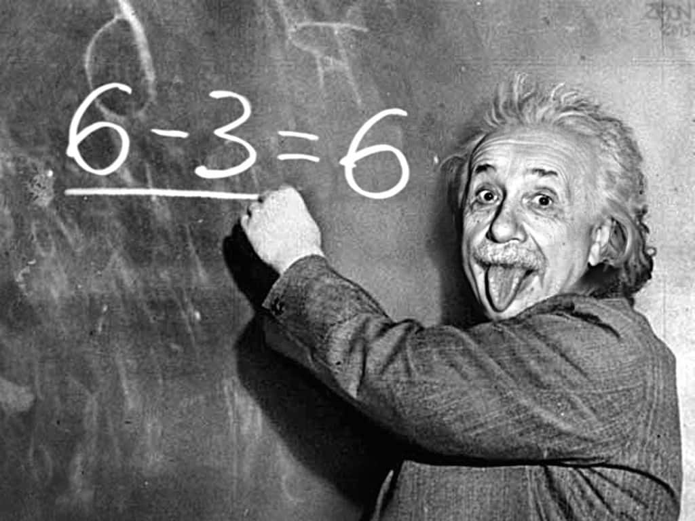
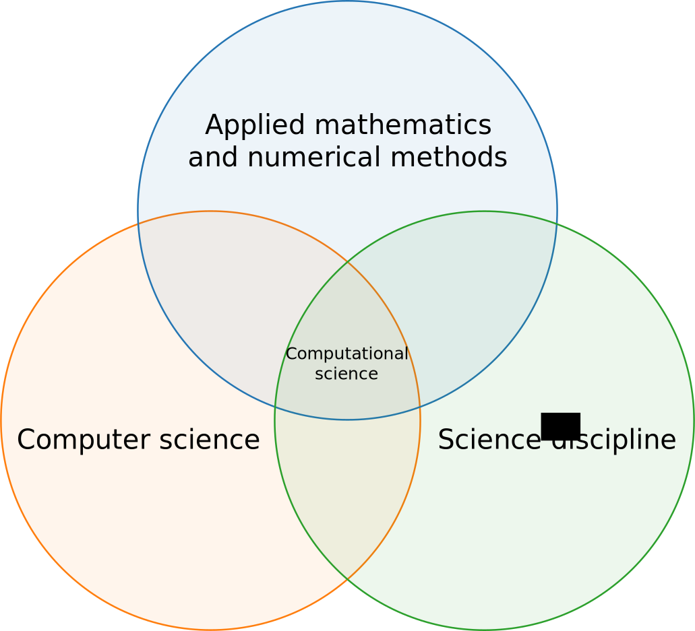
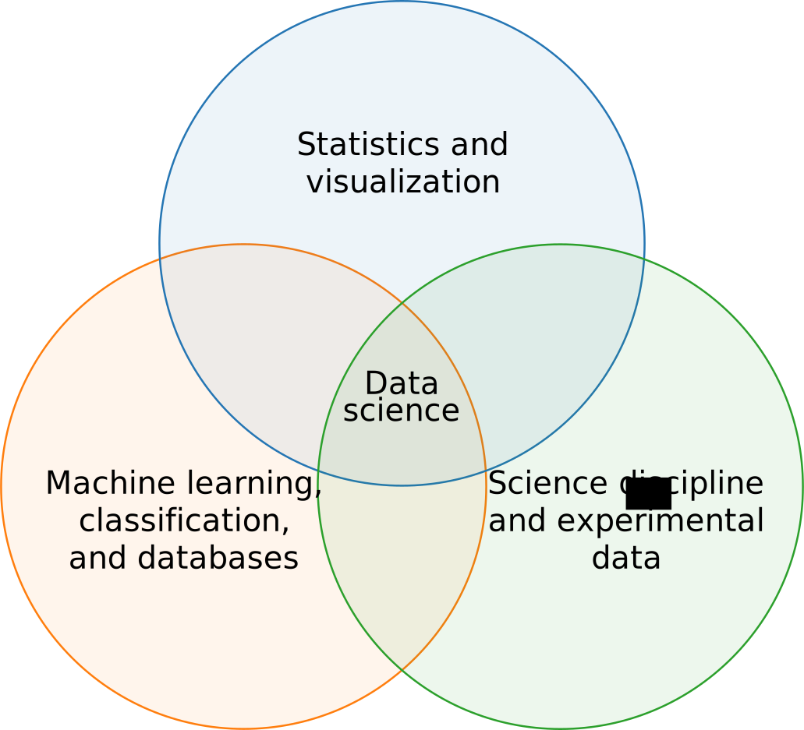
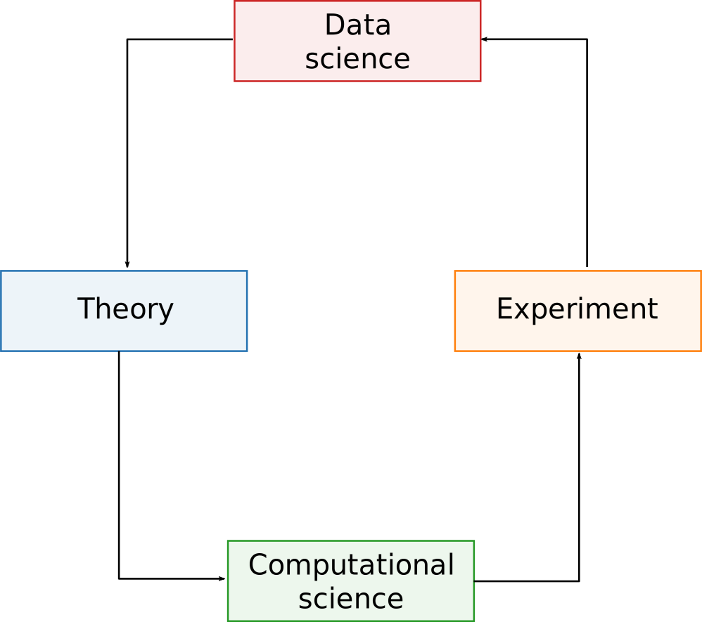
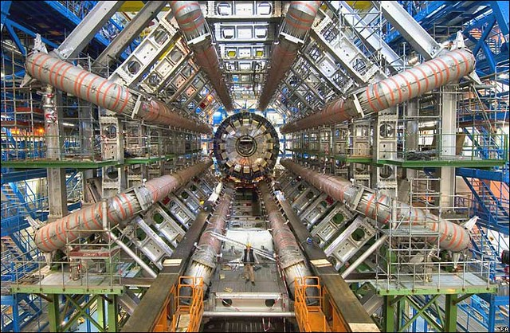

class: center, middle, title-slide

.upper-right[
```{r logo, eval = TRUE, echo = FALSE, out.width = "605px"}
knitr::include_graphics("../../img/cds-101-online-logo.png")
```
]

.lower-right[
```{r cc-by-sa, eval = TRUE, echo = FALSE, out.width = "88px"}
knitr::include_graphics("../../img/cc-by-nc-sa.png")
```

These slides are licensed under a [Creative Commons Attribution-ShareAlike 4.0 International License](http://creativecommons.org/licenses/by-sa/4.0/).
]

# .font90[What are the computational and data sciences?]
.title-hline[
## Science and CDS
]

```{r setup, include = FALSE}
# DO NOT ALTER THIS CHUNK
source("../../R/xaringan_setup.R")
```

---

# What is science?

--

.pull-left[]

--

.pull-right[]

---

# What is science?

Science is a way of looking at the world.

The scientific method:

* Review evidence
* Hypothesis
* Test hypothesis with experiment
* Validate or revise hypothesis

---

# What is computational science?

Computational science vs. computer science

```{r venn-diagram-comp-sci, echo = FALSE, out.width = "55%"}

```

Computational science is also known as scientific computing.

--

Covered in more depth in **CDS 130:** *Computing for Scientists*

---

# What is data science?

```{r venn-diagram-data-sci, echo = FALSE, out.width = "65%"}

```

---

# .font80[What are the computational and data sciences?]

The use of computers and data to explore problems and test hypotheses within the sciences.

```{r cs-ds-flow, echo = FALSE, out.width = "60%"}

```

---

# Why should you care about this course?

--

The average scientific researcher spends:

* 30% of their time developing scientific software
* 40% of their time using scientific software 

...yet many undergraduate natural science programs do not integrate computational skills into the curriculum.

*Source: Hannay et. al., in SECSE Conference (2009), pp. 1-8*

---

# Data is everywhere

```{r pile-of-documents, echo = FALSE, out.width="50%", out.extra='style="display:float;position:fixed;top:15%;left:3%"'}

```


```{r nasa-universe-timeline, echo = FALSE, out.width="40%", out.extra='style="display:float;position:fixed;top:15%;right:5%"'}

```

```{r scientist-icon, echo = FALSE, out.width="35%", out.extra='style="display:float;position:fixed;top:60%;right:50%"'}

```

---

# Credits

.left-column[
License

Acknowledgments
]

.right-column[
.font80[[Creative Commons Attribution-NonCommerical-ShareAlike 4.0 International](https://creativecommons.org/licenses/by-nc-sa/4.0/)]

Content adapted from the [Lecture 1: The Computational and Data Sciences slides](http://bobweigel.net/cds101/index.php?title=lecture1) by John Wallin.
]
