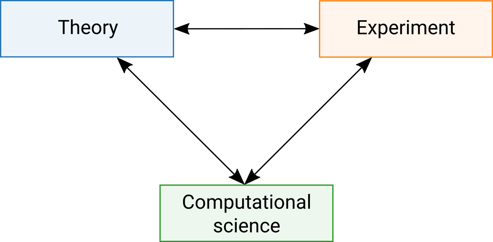
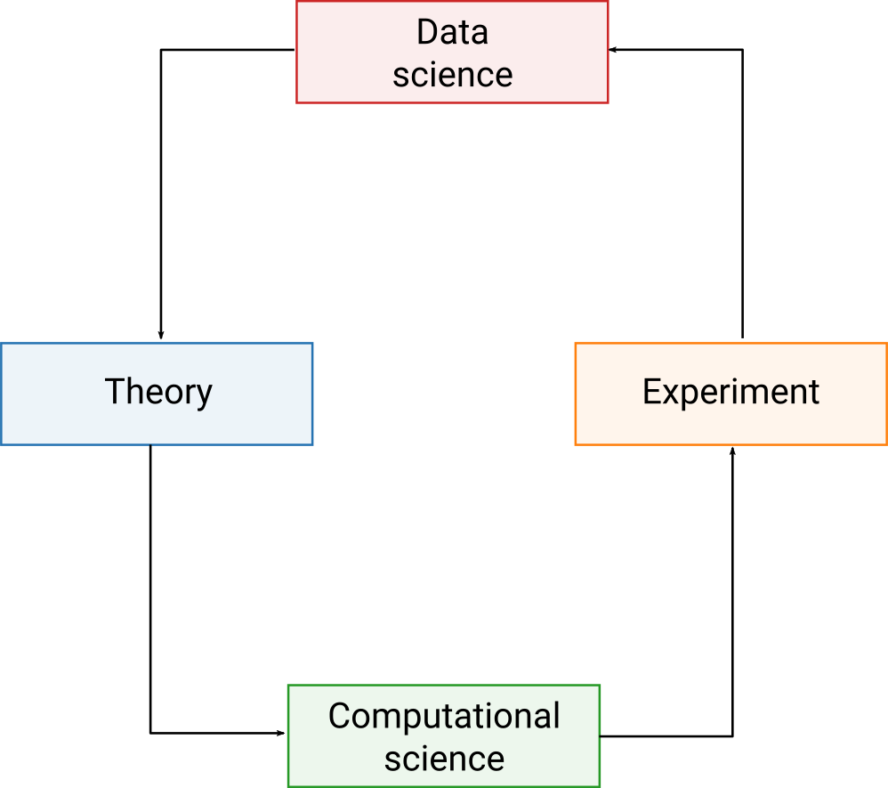

class: center, middle, title-slide

.upper-right[
```{r logo, eval = TRUE, echo = FALSE, out.width = "605px"}
knitr::include_graphics("../../img/cds-101-online-logo.png")
```
]

.lower-right[
```{r cc-by-sa, eval = TRUE, echo = FALSE, out.width = "88px"}
knitr::include_graphics("../../img/cc-by-nc-sa.png")
```

These slides are licensed under a [Creative Commons Attribution-ShareAlike 4.0 International License](http://creativecommons.org/licenses/by-sa/4.0/).
]

# .font90[What are the computational and data sciences?]
.title-hline[
## Computation
]

```{r setup, include = FALSE}
# DO NOT ALTER THIS CHUNK
source("../../R/xaringan_setup.R")
```

---

# Modes of science

.valign-slide[
```{r science-theory-experiment, echo = FALSE, out.width = "70%"}

```
]

---

# Modes of science

.valign-slide[
```{r science-theory-experiment-comp-sci, echo = FALSE, out.width = "70%"}

```
]

---

# Defining computational science

```{r venn-diagram-comp-sci, echo = FALSE, out.width = "65%"}
knitr::include_graphics("../../img/venn_diagram_computational_science.svg")
```

---

# Defining data science

```{r venn-diagram-data-sci, echo = FALSE, out.width = "65%"}
knitr::include_graphics("../../img/venn_diagram_data_science.svg")
```

---

# Computational and data sciences

```{r science-theory-experiment-comp-data-sci, echo = FALSE, out.width = "75%"}

```

---

# Big data looms

.valign-slide.quote-container[
> Big data [refers to] data sets that are so big and complex that traditional data-processing application software [is] inadequate to deal with them. Big data challenges include capturing data, data storage, data analysis, search, sharing, transfer, visualization, querying, updating, [and] information privacy [...] There are a number of concepts associated with big data: originally there were 3 concepts volume, variety, velocity. Other concepts later attributed with big data are veracity (i.e., how much noise is in the data) and value.
> .cite[[Wikipedia](https://en.wikipedia.org/wiki/Big_data)]
]

---

<h1 style="margin-bottom:10%">Why are new skills and training needed?</h1>

--

* The average scientific researcher devotes as much as 30% of their time developing and 40% of their time using scientific software (Hannay et. al., in SECSE Conference (2009), pp. 1-8), yet many undergraduate natural science programs do not integrate computational skills into the curriculum

--

* A lack of computational skills increases the risk of computational errors, which hurt reproducibility and can even invalidate a study's conclusions (Merali, Nature 467, 775 (2010))

--

* Automated workflows with error-checking are very important when working with large datasets

--

* Researchers in the computational and data sciences often need to communicate results to non-experts, which requires effective visualizations and developing the ability to write and present a clear and compelling story

---

<h1 style="margin-bottom:15%">Why are new skills and training needed?</h1>

* Data cleaning is a prerequisite to analyzing data in most contexts and disciplines

--

* Many computational tasks map onto workflows where you apply a series of data transformations in a certain order

--

* Data science methods applied to other fields: medicine, the humanities, political science, law, and the list goes on

---

<h1 style="margin-bottom:25%">Focus of this course</h1>

* The computational and data sciences are **very** broad

--

* Focus is on the tools, methods, and practices within *data science* category

--

  * If you also want to be introduced to the *computational science* side of things, consider taking CDS 130!
  
---

<h1 style="margin-bottom:10%">Main topics</h1>

* Learning a toolset that facilitates reproducible research

--

* Data visualization

--

* Data transformations

--

* Data cleaning and reshaping (tidying)

--

* Using statistical tools to interpret data distributions

--

* Inference and simulation

--

* Modeling

--

* Special topic: basics of web scraping

---

# Credits

.left-column[
License

Acknowledgments
]

.right-column[
.font80[[Creative Commons Attribution-NonCommerical-ShareAlike 4.0 International](https://creativecommons.org/licenses/by-nc-sa/4.0/)]

Content adapted from the [Lecture 1: The Computational and Data Sciences slides](http://bobweigel.net/cds101/index.php?title=lecture1) by John Wallin.
]
