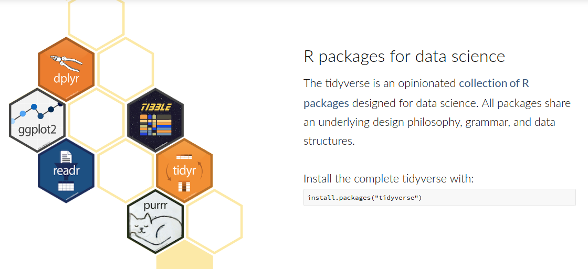
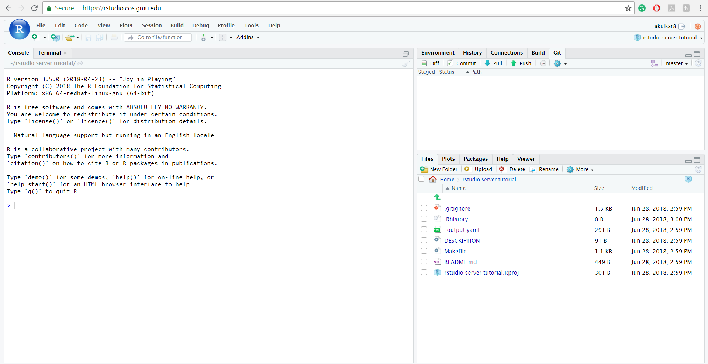
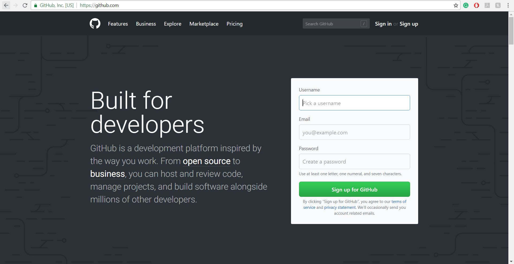
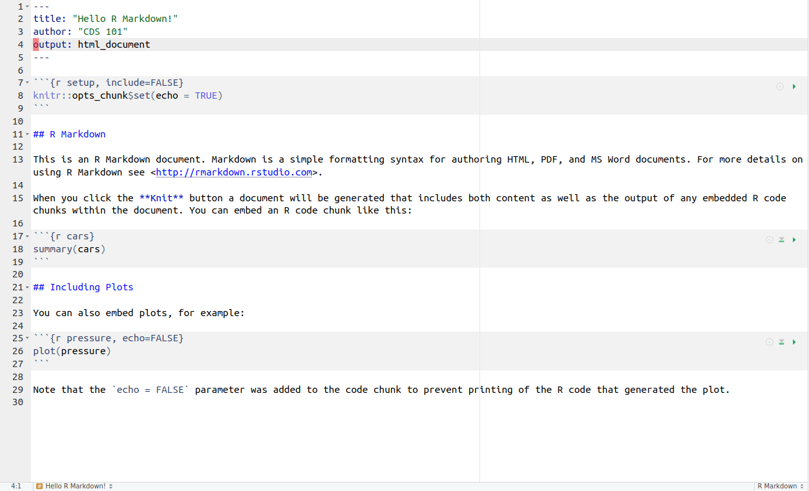

class: center, middle, title-slide

.upper-right[
```{r logo, eval = TRUE, echo = FALSE, out.width = "605px"}
knitr::include_graphics("../../img/cds-101-online-logo.png")
```
]

.lower-right[
```{r cc-by-sa, eval = TRUE, echo = FALSE, out.width = "88px"}
knitr::include_graphics("../../img/cc-by-nc-sa.png")
```

These slides are licensed under a [Creative Commons Attribution-NonCommercial-ShareAlike 4.0 International License](http://creativecommons.org/licenses/by-nc-sa/4.0/).
]

# .font90[Reproducible toolbox]
.title-hline[
## Reproducible research toolkit
]

```{r setup, include = FALSE}
# DO NOT ALTER THIS CHUNK
source("../../R/xaringan_setup.R")
library(ggplot2)
```

---

<h1 style="margin-bottom: 7%;">Reproducibility checklist</h1>

.qa[
What does it mean for a data analysis to be "reproducible"?
]

--

Near-term goals:

* Are the tables and figures reproducible from the code and data?

* Does the code actually do what you think it does?

* In addition to what was done, is it clear **why** it was done? (e.g., how were parameter settings chosen?)

Long-term goals:

* Can the code be used for other data?

* Can you extend the code to do other things?

---

layout: true

# Meet the toolkit

---

.answer.center[**Primary tool:** R]

```{r r-logo, echo = FALSE, out.width = "20%"}
knitr::include_graphics("../../img/r-logo.png")
```

.pull-left[
.code70[
```r
side_one <- 3
side_two <- 4
hypotenuse <- sqrt(side_one^2 + side_two^2)
result <- paste(
  "A triangle with sides of length",
  side_one,
  "and length",
  side_two,
  "has a hypotenuse of length",
  hypotenuse
)

print(result)
```
]
]

.pull-right[
```{r sample-r-snippet, echo = FALSE, results = "markup"}
side_one <- 3
side_two <- 4
hypotenuse <- sqrt(side_one^2 + side_two^2)
result <- paste0(
  "[1] A triangle with sides of",
  "\n",
  "length ",
  side_one,
  " and length ",
  side_two,
  " has a",
  "\n",
  "hypotenuse of length ",
  hypotenuse
)

cat(result)
```
]

---

.answer.center[**Utility belt:** tidyverse packages]

```{r tidyverse-logo, echo = FALSE, out.width = "100%", out.extra="style='margin-top: 7%'"}

```

---

.answer.center[**Workshop:** RStudio Server]

```{r rstudio-logo, echo = FALSE, out.width = "20%"}
knitr::include_graphics("../../img/rstudio-logo.png")
```

```{r rstudio-server-screenshot, echo = FALSE, out.width = "100%"}

```

---

.answer.center[**Storage room:** GitHub]

```{r github-logo, echo = FALSE, out.width = "25%"}
knitr::include_graphics("../../img/github-logo.svg")
```

```{r github-screenshot, echo = FALSE, out.width = "100%"}

```

---

layout: false

# Some R history

.valign-slide[
* The first stable version of R, v1.0.0, was released on February 29, 2000.

* R itself is an implementation of the [S programming language](https://en.wikipedia.org/wiki/S_(programming_language), which was designed at Bell Laboratories in the mid-1970s.

* *Base R* was built for statisticians and for doing data analysis, but not necessarily for modern Data Science

* It's age and legacy brings along old implementations of data structures and abbreviated function (commands) names
]

.footnote[
Source: David Smith, *[Over 16 years of R project history](http://blog.revolutionanalytics.com/2016/03/16-years-of-r-history.html)*, [Revolutions blog](http://blog.revolutionanalytics.com), last updated on March 4, 2016, accessed September 20, 2017, <http://blog.revolutionanalytics.com/2016/03/16-years-of-r-history.html>
]

---

# Modernizing R with `tidyverse`

.valign-slide[
Over the last 3 years, chief scientist at RStudio, Hadley Wickham, has brought R into the modern era with the `tidyverse`.

.quote-container[
> The tidyverse is an opinionated collection of R packages designed for data science.
> All packages share an underlying philosophy and common APIs.
.cite[[Front page of the Tidyverse website](https://www.tidyverse.org/)]
]

In practice, this meant reducing everything to a small, core set of commands that all behave in a similar way.
]

---

<h1 style="margin-bottom: 9%;">R essentials</h1>

A short list (for now):

--

* Functions are (most often) verbs, followed by what they will be applied to in parentheses:

  ```r
  do_this(to_this)
  do_that(to_this, to_that, with_those)
  ```

--

* Packages are installed with the `install.packages` function and loaded with the `library` function, once per session:

  ```r
  install.packages("package_name")
  library(package_name)
  ```

--

* Packages bring in additional functions for us to use!

---

# R Markdown

```{r hello-r-markdown, echo = FALSE, out.width = "85%"}

```

.font80[
* Fully reproducible reports – each time you knit the analysis is ran from the beginning

* Simple markdown syntax for text

* Code goes in chunks, defined by three back-ticks, narrative goes outside of chunks
]

---

count: false

# R Markdown

```{r hello-r-markdown, echo = FALSE, out.width = "85%"}
```

<div style="margin-top: 5%"></div>

.answer.center[
If it works for you, then it works for me!
]

---

# How will we use R Markdown?

.vhalign-slide[
* You will submit all your homework assignments and the final group project as an R Markdown document

* You will be shown examples in the form of "real-time" demos inside an R Markdown document. While watching, you should create your own document and follow along!

* For assignments, you'll always have a template R Markdown document to start with
]

---

# Credits

.left-column[
License

Acknowledgments
]

.right-column[
.font80[[Creative Commons Attribution-NonCommerical-ShareAlike 4.0 International](https://creativecommons.org/licenses/by-nc-sa/4.0/)]

Content adapted from the [Meet the toolkit slides](https://github.com/Sta112-F18/website/blob/5d19479bc2f3a9ba1f8c5a803cf6dd699376bc00/static/slides/u1_d01-meet-the-toolkit/u1_d01-meet-the-toolkit.Rmd) by Mine Çetinkaya-Rundel and made available under the [CC BY 4.0 license](http://creativecommons.org/licenses/by/4.0/).
]
