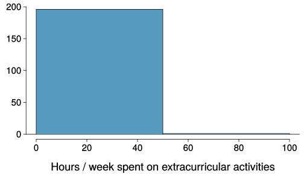
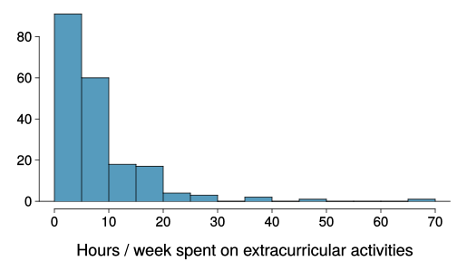

class: center, middle, title-slide

.upper-right[
```{r logo, eval = TRUE, echo = FALSE, out.width = "605px"}
knitr::include_graphics("../../img/cds-101-online-logo.png")
```
]

.lower-right[
```{r cc-by-sa, eval = TRUE, echo = FALSE, out.width = "88px"}
knitr::include_graphics("../../img/cc-by-nc-sa.png")
```

These slides are licensed under a [Creative Commons Attribution-NonCommercial-ShareAlike 4.0 International License](http://creativecommons.org/licenses/by-nc-sa/4.0/).
]

# .font90[Data visualization]
.title-hline[
## Plots of One Variable
]

```{r setup, include = FALSE}
# DO NOT ALTER THIS CHUNK
source("../../R/xaringan_setup.R")
library(tidyverse)
```

---

# `qplot()` with a single variable

We can plot different types of graph with `qplot()`. If we only pass an argument to the `x` parameter of `qplot()`...

```{r}
qplot(x = height, data = starwars)
```

... we get a type of graph called a histogram.

The `height` variable has been plotted on the `x` axis.

What are the numbers on the `y` axis in a histogram?

---

# A histogram shows counts

In a histogram, the x-axis variable is divided up into "bins" (i.e. the bars). The height of each bin corresponds to the number of observations that fall in each bin.

Each dot here represents an observation (i.e. a row containing a Star Wars character in the dataset).

```{r}
wbins <- 9
ggplot(starwars, aes(x = height)) +
  geom_histogram(binwidth=wbins, color = "white") +
  geom_dotplot(
    fill = "white", 
    stroke = 2, 
    binwidth=wbins, 
    method = "histodot", 
    dotsize= 0.68, #for 9
    alpha = 1
    )
```

It is apparent that the y-axis is the *count* of the observations in each bin.

---

# Bin width

.qa[
Which one(s) of these histograms are useful? Which reveal too much about the data? Which hide too much?
]

.pull-left[
```{r extracurr-hrs-hist-binwidth-1, echo = FALSE, out.width = "90%", output = "markup"}

knitr::include_graphics("../../img/extracurr_hrs_hist.svg")
```
]

.pull-right[
```{r extracurr-hrs-hist-binwidth-2, echo = FALSE, out.width = "90%"}

knitr::include_graphics("../../img/extracurr_hrs_hist30.svg")
```
]

The number of bins can be set by including the the `bins` parameter in `qplot()`. Alternatively you can set the `binwidth` parameter.

---

# Bar graphs for categorical data

If we pass a categorical variable to the `x` parameter, then we will get a bar graph.

```{r}
qplot(x = sex, data=starwars)
```

In a bar graph, each bar correponds to the number of rows in each category (in this case, that is the number of Star Wars characters of each sex).

---

# Credits

.left-column[
License

Acknowledgments
]

.right-column[
.font80[[Creative Commons Attribution-NonCommerical-ShareAlike 4.0 International](https://creativecommons.org/licenses/by-nc-sa/4.0/)]

Content adapted from the Chapter 1 [OpenIntro Statistics Slides](https://github.com/OpenIntroOrg/openintro-statistics-slides) developed by Mine Cetinkaya-Rundel and made available under the [CC BY-SA 3.0 license](http://creativecommons.org/licenses/by-sa/3.0/us/).
]
