class: center, middle, title-slide

.upper-right[
```{r logo, eval = TRUE, echo = FALSE, out.width = "605px"}
knitr::include_graphics("../../img/cds-101-online-logo.png")
```
]

.lower-right[
```{r cc-by-sa, eval = TRUE, echo = FALSE, out.width = "88px"}
knitr::include_graphics("../../img/cc-by-nc-sa.png")
```

These slides are licensed under a [Creative Commons Attribution-NonCommercial-ShareAlike 4.0 International License](http://creativecommons.org/licenses/by-nc-sa/4.0/).
]

# .font90[Data visualization]
.title-hline[
## Examining numerical data
]

```{r setup, include = FALSE}
# DO NOT ALTER THIS CHUNK
source("../../R/xaringan_setup.R")
```

---

# .font80[Describing shapes of numerical distributions]

.valign-slide[
* shape:

  * skewness: right-skewed, left-skewed, symmetric (skew is to the side of the longer tail)

  * modality: unimodal, bimodal, multimodal, uniform

* center: mean, median, mode (not always useful)

* spead: range, standard deviation, inter-quartile range

* unusual observations
]

---

# Dot plots

.valign-slide[
Useful for visualizing one numerical variable. Darker colors represent areas where there are more observations.

```{r gpa-dot-plot, echo = FALSE}

```

.qa[
How would you describe the distribution of GPAs in this data set?
Make sure to say something about the center, shape, and spread of the distribution.
]
]

---

# Dot plots & mean

.valign-slide[
```{r gpa-dot-plot-mean, echo = FALSE}

```

* The **mean**, also called the **average** (marked with a triangle in the above plot), is one way to measure the center of a **distribution** of data.

* The mean GPA is 3.59.
]

---

# Mean

.valign-slide.latex[
* The **sample mean**, denoted as $\mathbf{\bar{x}}$, can be calculated as
  $$\bar{x} = \frac{x_1 + x_2 + \dots + x_n}{n},$$
  where $x_1, x_2, \cdots, x_n$ represent the **n** observed values.

* The **population mean** is also computed the same way but is denoted as $\mathbf{\mu}$.
  It is often not possible to calculate $\mu$ since population data are rarely available.

* The sample mean is a **sample statistic**, and serves as a **point estimate** of the population mean.
  This estimate may not be perfect, but if the sample is good (representative of the population), it is usually a pretty good estimate. 
]

---

# Histograms

* Histograms provide a view of the **data density**.
  Higher bars represent where the data are relatively more common.

* Histograms are especially convenient for describing the **shape** of the data distribution.

* The chosen **bin width** can alter the story the histogram is telling.

```{r extracurr-hrs-hist, echo = FALSE, out.width = "70%"}
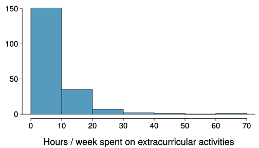
```

---

# Bin width

.qa[
Which one(s) of these histograms are useful? Which reveal too much about the data? Which hide too much?
]

.pull-left[
```{r extracurr-hrs-hist-binwidth-1, echo = FALSE, out.width = "90%", output = "markup"}
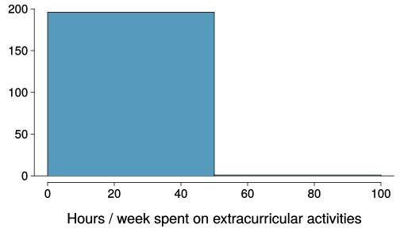

```
]

.pull-right[
```{r extracurr-hrs-hist-binwidth-2, echo = FALSE, out.width = "90%"}
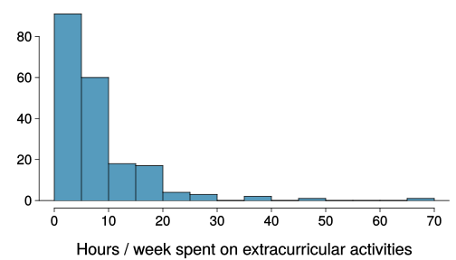
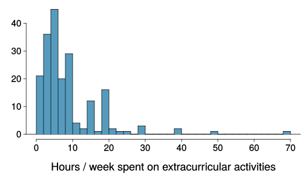
```
]

---

# Shape of a distribution: modality

.qa[
Does the histogram have a single prominent peak (unimodal), several prominent peaks (bimodal/multimodal), or no apparent peaks (uniform)?
]

<div style="margin-bottom: 10%;"></div>

```{r single-bi-multi-modal-unif-plots, echo = FALSE, out.width = "95%"}
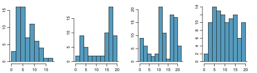
```

.footnote[
In order to determine modality, step back and imagine a smooth curve over the histogram – imagine that the bars are wooden blocks and you drop a spaghetti over them, the shape the spaghetti would take could be viewed as a smooth curve.
]

---

# Shape of a distribution: skewness

.qa[
Is the histogram right skewed, left skewed, or symmetric?
]

<div style="margin-bottom: 10%;"></div>

```{r skewed-sym-plots, echo = FALSE, out.width = "85%"}
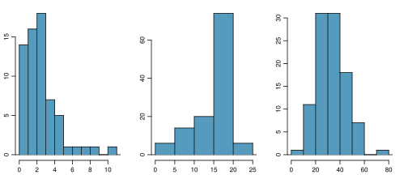
```

.footnote[
Histograms are said to be skewed to the side of the long tail.
]

---

# .font80[Shape of a distribution: unusual observations]

.qa[
Are there any unusual observations or potential outliers?
]

<div style="margin-bottom: 10%;"></div>

```{r outlier-plots, echo = FALSE, out.width = "85%"}
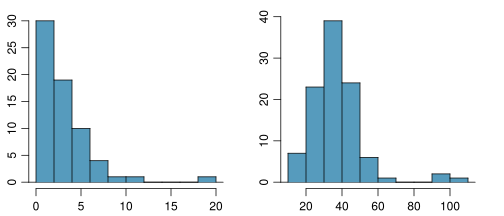
```

---

# .font80[Commonly observed shapes of distributions]

<div style="margin-bottom: 12%;"></div>

Modality

```{r modality-drawings, echo = FALSE, out.width = "100%"}
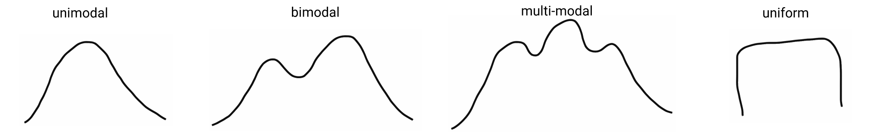
```

Skewness

```{r skewness-drawings, echo = FALSE, out.width = "75%"}
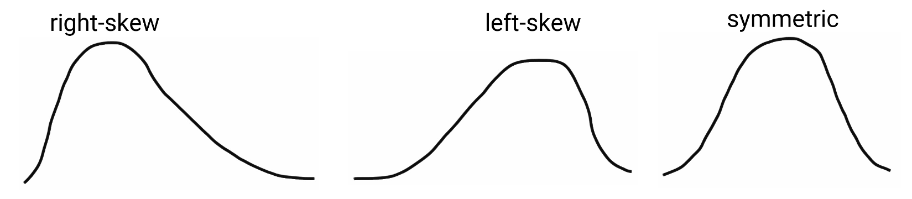
```

---

# What about categorical data?

Segmented bar and mosaic plots

```{r gender-data-categorical, out.width = "65%", echo = FALSE}
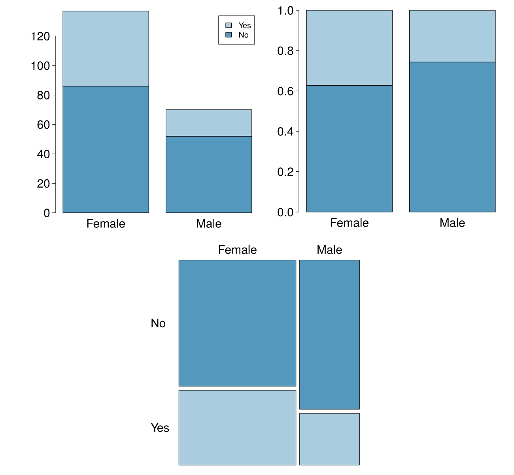
```

---

# Pie charts

Can you tell which order encompasses the lowest percentage of mammal species?

```{r mammal-pie-chart, echo = FALSE}
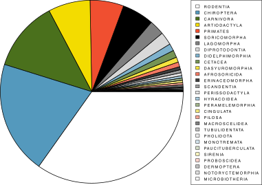
```

.footnote[
Source: Data from www.departments.bucknell.edu/biology/resources/msw3/
]

---

# Credits

.left-column[
License

Acknowledgments
]

.right-column[
.font80[[Creative Commons Attribution-NonCommerical-ShareAlike 4.0 International](https://creativecommons.org/licenses/by-nc-sa/4.0/)]

Content adapted from the Chapter 1 [OpenIntro Statistics Slides](https://github.com/OpenIntroOrg/openintro-statistics-slides) developed by Mine Cetinkaya-Rundel and made available under the [CC BY-SA 3.0 license](http://creativecommons.org/licenses/by-sa/3.0/us/).
]
