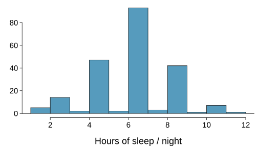
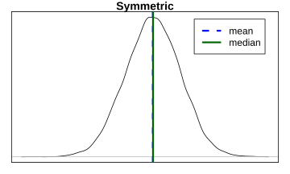
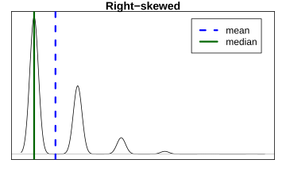
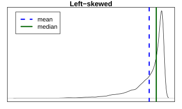
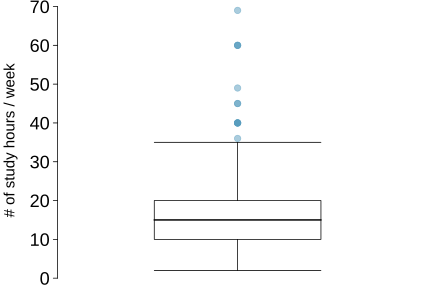
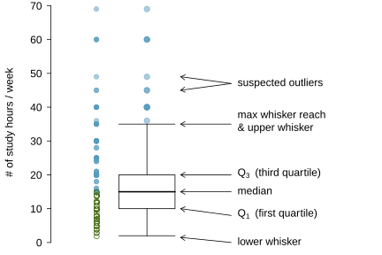

class: center, middle, title-slide

.upper-right[
```{r logo, eval = TRUE, echo = FALSE, out.width = "605px"}
knitr::include_graphics("../../img/cds-101-online-logo.png")
```
]

.lower-right[
```{r cc-by-sa, eval = TRUE, echo = FALSE, out.width = "88px"}
knitr::include_graphics("../../img/cc-by-nc-sa.png")
```

These slides are licensed under a [Creative Commons Attribution-NonCommercial-ShareAlike 4.0 International License](http://creativecommons.org/licenses/by-nc-sa/4.0/).
]

# .font90[Data distributions]
.title-hline[
## Quantifying data distributions
]

```{r setup, include = FALSE}
# DO NOT ALTER THIS CHUNK
source("../../R/xaringan_setup.R")
# Load required packages
library(ggplot2)
library(dplyr)
library(readr)
# Load datasets
house_income <- read_csv("../../data/house_income.csv")
basket_games <- read_csv("../../data/basketball_games_attendance.csv")
```

---

# Variance

<div style="margin-bottom: 7%"></div>

**Variance** is roughly the average squared deviation from the mean.

$$s^{2}=\dfrac{\sum_{i=1}^{n}\left(x_i-\bar{x}\right)^{2}}{n-1}$$

.pull-left[
* The sample mean is $\bar{x}=6.71$, and the sample size is $n=217$.

* The variance of amount of sleep students get per night can be calculated as:
]

.pull-right[
```{r sleep-histogram, echo = FALSE, out.width = "100%"}

```
]

<div style="margin-bottom: 5%"></div>

$$s^{2}=\dfrac{(5-6.71)^{2}+(9-6.71)^{2}+\cdots{}+(7-6.71)^{2}}{217-1}=4.11\text{ hours}^{2}$$

---

# Variance

<div style="margin-bottom: 21%"></div>

.qa[
Why do we use the squared deviation in the calculation of variance?
]

.answer[
* To get rid of negatives so that observations equally distant from the mean are weighed equally.

* To weigh larger deviations more heavily.
]

---

# Standard deviation

<div style="margin-bottom: 10%"></div>

The **standard deviation** is the square root of the variance, and has the same units as the data.

$$s=\sqrt{s^2}$$

<div style="margin-bottom: 5%"></div>

.pull-left[
* The standard deviation of amount of sleep students get per night can be calculated as:

  $$s=\sqrt{4.11}=2.03\text{ hours}$$

* We can see that all of the data are within 3 standard deviations of the mean.
]

.pull-right[
```{r sleep-histogram, echo = FALSE, out.width = "100%"}
```
]

---

# Median

<div style="margin-bottom: 15%"></div>

* The **median** is the value that splits the data in half when ordered in ascending order.
  
  $$0,1,\mathbf{2},3,4$$

* If there are an even number of observations, then the median is the average of the two values in the middle.

  $$0,1,\underline{2,3},4,5\rightarrow\dfrac{2+3}{2}=\mathbf{2.5}$$

* Since the median is the midpoint of the data, 50% of the values are below it. Hence, it is also the $50^{th}$ percentile.

---

# Mean vs. median

If the distribution is symmetric, center is often defined as the mean: mean $\approx$ median

```{r symmetric-dist, echo = FALSE, out.width = "30%"}

```

.pull-left[
If the distribution is skewed or has extreme outliers, center is often defined as the median

*   Right-skewed: mean $>$ median
  
*   Left-skewed: mean $<$ median
]

.pull-right[
```{r rs-dist, echo = FALSE}

```
```{r ls-dist, echo = FALSE}

```
]

---

# Q1, Q3, and IQR

<div style="margin-bottom: 15%"></div>

* The $25^{th}$ percentile is also called the first quartile, **Q1**.

* The $50^{th}$ percentile is also called the median.

* The $75^{th}$ percentile is also called the third quartile, **Q3**.

* Between Q1 and Q3 is the middle 50% of the data. The range these data span is called the **interquartile** range, or the **IQR**.

<div style="margin-bottom: 8%"></div>

$$IQR=Q3-Q1$$

---

# Box plot

The box in a **box plot** represents the middle 50% of the data, and the thick line in the box is the median.

```{r study-hours-box, echo = FALSE, out.width = "80%"}

```

---

# Anatomy of a box plot

```{r study-hours-box-layout, echo = FALSE, out.width = "100%"}

```

---

# Whiskers and outliers

<div style="margin-bottom: 8%"></div>

**Whiskers** of a box plot can extend up to $1.5\times{}\text{IQR}$ away from the quartiles.

<div style="margin-bottom: 8%"></div>

$$\text{max upper whisker reach}=Q3+1.5\times{}\text{IQR}$$

$$\text{max lower whisker reach}=Q1-1.5\times{}\text{IQR}$$

<div style="margin-bottom: 5%"></div>

$$\text{IQR: }20-10=10$$

<div style="margin-bottom: 5%"></div>

$$\text{max upper whisker reach}=20+1.5\times{}10=35$$

$$\text{max lower whisker reach}=10-1.5\times{}10=-5$$

<div style="margin-bottom: 8%"></div>

A potential **outlier** is defined as an observation beyond the maximum reach of the whiskers. It is an observation that appears extreme relative to the rest of the data.

---

# Outliers (cont.)

<div style="margin-bottom: 20%"></div>

.qa[
Why is it important to look for outliers?
]

.answer[
* Identify extreme skew in the distribution.

* Identify data collection and entry errors.

* Provide insight into interesting features of the data.
]

---

# Extreme observations

.qa[
How would sample statistics such as mean, median, SD, and IQR of household income be affected if the largest value was replaced with $10 million? What if the smallest value was replaced with $10 million?
]

```{r house-income-dot-stacked, echo = FALSE, out.width = "80%"}
ggplot(house_income) +
  geom_dotplot(
    mapping = aes(house_income),
    binwidth = 20000,
    method = "histodot",
    stackratio = 1.2
  ) +
  xlim(combine(0, 1.E6)) +
  xlab("Annual household income") +
  scale_y_continuous(NULL, breaks = NULL)
```

---

# Robust statistics

```{r house-income-dot-stacked, echo = FALSE, out.width = "70%"}
```

| scenario                      | median | IQR  | $\bar{x}$ | s    |
| ----------------------------- | ----   | ---- | ----      | ---- |
| original data                 | 190K   | 200K | 245K      | 226K |
| move largest to $10 million   | 190K   | 200K | 309K      | 853K |
| move smallest to $10 million  | 200K   | 200K | 316K      | 854K |

---

# Robust statistics

<div style="margin-bottom: 10%"></div>

Median and IQR are more robust to skewness and outliers than mean and SD. Therefore,

* for skewed distributions it is often more helpful to use median and IQR to describe the center and spread

* for symmetric distributions it is often more helpful to use the mean and SD to describe the center and spread

<div style="margin-bottom: 5%"></div>

.qa[
If you would like to estimate the typical household income for a student, would you be more interested in the mean or median income?
]

.answer[
Median
]

---

# Extremely skewed data

<div style="margin-bottom: 10%"></div>

When data are extremely skewed, transforming them might make modeling easier. A common transformation is the **log transformation**.

The histogram on the bottom left shows the distribution of number of basketball games attended by students. The histogram on the bottom right shows the distribution of log of number of games attended.

.pull-left[
```{r basketball-games-distribution, echo = FALSE, out.width = "100%", dpi = 150}
ggplot(data = basket_games) +
  geom_histogram(
    mapping = aes(x = basket_games),
    binwidth = 10,
    center = 5,
    color = "turquoise4",
    fill = "turquoise2"
  ) +
  labs(x = "# of basketball games attended", y = NULL)
```
]

.pull-right[
```{r basketball-games-log-distribution, echo = FALSE, out.width = "100%", dpi = 150}
ggplot(data = basket_games) +
  geom_histogram(
    mapping = aes(x = log(basket_games)),
    binwidth = 0.5,
    center = 0.25,
    color = "turquoise4",
    fill = "turquoise2"
  ) +
  labs(x = "# of basketball games attended", y = NULL)
```

]

---

# Pros and cons of transformations

<div style="margin-bottom: 17%"></div>

Skewed data are easier to model with when they are transformed because outliers tend to become far less prominent after an appropriate transformation.

```
# of games             70      50      25    ···
log10(# of games)    4.25    3.91    3.22    ···
```

However, results of an analysis might be difficult to interpret because the log of a measured variable is usually meaningless.

---

# Credits

.left-column[
License

Acknowledgments
]

.right-column[
.font80[[Creative Commons Attribution-NonCommerical-ShareAlike 4.0 International](https://creativecommons.org/licenses/by-nc-sa/4.0/)]

Content adapted from the Chapter 1 [OpenIntro Statistics slides](https://github.com/OpenIntroOrg/openintro-statistics-slides) developed by Mine Çetinkaya-Rundel and made available under the [CC BY-SA 3.0 license](http://creativecommons.org/licenses/by-sa/3.0/us/).
]
