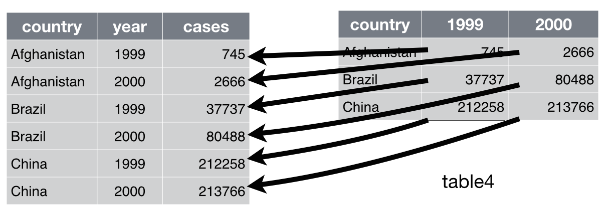

class: center, middle, title-slide

.upper-right[
```{r logo, eval = TRUE, echo = FALSE, out.width = "605px"}
knitr::include_graphics("../../img/cds-101-online-logo.png")
```
]

.lower-right[
```{r cc-by-sa, eval = TRUE, echo = FALSE, out.width = "88px"}
knitr::include_graphics("../../img/cc-by-nc-sa.png")
```

These slides are licensed under a [Creative Commons Attribution-NonCommercial-ShareAlike 4.0 International License](http://creativecommons.org/licenses/by-nc-sa/4.0/).
]

# .font90[Data reshaping]
.title-hline[
## The .mono[pivot_longer()] function
]

```{r setup, include = FALSE}
# DO NOT ALTER THIS CHUNK
source("../../R/xaringan_setup.R")
library(dplyr)
library(tidyr)
library(flair)
name_of_dataset <- tibble(column_one=1, column_two=2, column_three=3)
```

```{css, echo = FALSE}
# from https://community.rstudio.com/t/using-multiple-font-sizes-for-code-chunks/26405/5
.smaller-chunk .remark-code { /*Change made here*/
  font-size: 75% !important;
}
```

???

In this video we will see how to reshape a dataframe from wide to long, or in other words, how to convert columns into rows.

---

# `pivot_longer()`

.footnote[
Source: Figure 12.2 in *R for Data Science* by Garrett Grolemund and Hadley Wickham.
]

`pivot_longer()` takes columns and turns them into rows.

```{r mutate-schematic, out.width = "90%", echo = FALSE}

```

We do this by taking some columns from the dataframe and stacking them so that all their values are in a single new column (the *value* column).

We also create a second new column that indicates the name of the original column that each stacked value came from (in case you need that information later in a subsequent function).

???

We will use the `pivot_longer` function to do this. In picture on this slide, you can see an illustration of the kind of result we want to achieve. We want to take a wide dataframe like the one on the right with lots of columns, and reshape it into a long dataframe like the one on the left with lots of rows.

What we do is very simple. What we do is take all the columns we want to convert and stack them into a single column. You can see here that we're taking the 1999 and 2000 columns on the right, each of which has 3 rows, and stacking them into a single column with 6 rows.

It's important to note that we're not losing any data here. We had 6 cells of numbers before and we have 6 cells of data afterwards.

However, the observant among you will have notied that there was useful information in the column names of the original columns, 1999 and 2000. Those tell us the year in which those data were collected. We don't just want to throw that information away. So we create a second column, which stores the column name of the original column. In this example, we've create a new year column to hold the column names that each of the stacked cells came from, which, unsurprisingly.  For example, we can see the 745 value for Afghanistan originally came from a column called 1999, and so after pivoting we've stored 1999 in the corresponding years cell for that observation.

---

# Structure of `pivot_longer()`

.mono[pivot_longer()] takes columns and turns them into rows.

Here is a template for the main parameters of the function.

.smaller-chunk[
```{r, echo=FALSE}
decorate('pivot-demo-1') %>%
  flair_funs(background="Coral")
```

```{r pivot-demo-1, include=FALSE, results="hide"}
pivot_longer(
  name_of_dataset,
  cols = column_one | column_two,
  names_to = "name_column",
  values_to = "value_column"
)
```
]

Let's break this down line-by-line...

???

Here is how we would use the pivot_longer function. There are four arguments that we must provide. As with all functions, these go inside the parentheses after the function name.

For easy of reading, I have broken these arguments down over multiple lines. Normally R would run each line of code separately, but here it sees the opening parenthesis of the function on the first line, and so it knows that everything that comes after must be part of the same line until it reaches the closing parenthesis.

---

# Structure of `pivot_longer()`

The first parameter of the function takes as its argument the name of the dataset:

```{r, echo=FALSE}
decorate('pivot-demo-2') %>%
  flair("name_of_dataset")
```

```{r pivot-demo-2, include=FALSE, results="hide"}
pivot_longer(
  name_of_dataset,
  cols = column_one | column_two,
  names_to = "name_column",
  values_to = "value_column"
)
```

--

Remember that as the dataset is the first parameter, we can instead pipe the dataset to the function:
```{r, echo=FALSE}
decorate('pivot-demo-3') %>%
  flair("name_of_dataset") %>%
  # flair_funs(background="Coral") %>%
  flair("%>%", background="Aquamarine")
```

```{r pivot-demo-3, echo=FALSE}
name_of_dataset %>%
  pivot_longer(
    cols = column_one | column_two,
    names_to = "name_column",
    values_to = "value_column"
  )
```

???

The first argument of the function is the name of the dataframe that we want to reshape. Here I am calling that `name_of_dataset`, but obviously you would want to replace that with what ever variable your dataframe is stored in.

**Next.** The nice thing about the dataframe being the first argument is that it means that we can also pipe the dataframe to the function as you see in the second code chunk. When R runs this piece of code, it will insert the thing being piped in as the first argument of the pivot_longer function, and bump all the other arguments up one spot. So even though cols looks like the first argument there, it will still be the second argument.

This means we if we have another function whose output is a dataframe, such as mutate or filter, then we can pipe the output of those functions to pivot_longer. In this way, pivot_longer can become part of a longer sequence of functions that apply a series of transformations to a dataset.

---

# Structure of `pivot_longer()`

The second parameter, `cols`, takes as its argument the columns that you wish to convert into rows:

```{r, echo=FALSE}
decorate('pivot-demo-4') %>%
  flair_lines(3)
```

```{r pivot-demo-4, include=FALSE, results="hide"}
name_of_dataset %>%
  pivot_longer(
  cols = column_one | column_two,
  names_to = "name_column",
  values_to = "value_column"
)
```

Here we are converting two columns, called `column_one` and `column_two`, which we list separated by the vertical bar symbol `|`. 

There are other ways to specify the columns to be converted to rows, such as:

* Specifying a range of consecutive columns: `cols = column_one:column_three`

* Specifying every column in the dataframe *except* one, e.g. every column except `column_one`: `cols = !column_one`

???

Next we want to specify the columns to stack on top of each other and so convert into rows. We supply this information to the cols parameter. 

In this example I am stacking just two columns. In this imanginary dataset those are called column_one and column_two. To list a series of columns you can separate them by the vertical bar symbol, but there are many other ways of listing the columns as well. For a full list of these you should check out the documentation for the `pivot_longer()` function.

---

# Structure of `pivot_longer()`

The third argument to the function specifies the name of the new column that will be created to hold the names of the original columns (that we are converting to rows). We supply it to a parameter called `names_to`.

```{r, echo=FALSE}
decorate('pivot-demo-5') %>%
  flair_lines(4)
```

```{r pivot-demo-5, include=FALSE, results="hide"}
name_of_dataset %>%
  pivot_longer(
  cols = column_one | column_two,
  names_to = "name_column",
  values_to = "value_column"
)
```

Here we are calling the new column `name_column` (imaginative, I know), but you can call it whatever you wish.

Note that this is new name is a value (not an existing column), so we need to put it inside quotation marks.

The values in each row of this new column `name_column` will be one of the names of the original columns, i.e. either `column_one` or `column_two` in this example.

???

As I mentioned earlier in this video, we will create a new column that holds the names of the original columns. Because this is a new column we need to tell the pivot_longer function what it should be called. Here we are going to call it name_column, but you can call it anything. In general its a good idea to call it something that reflects the data in it.

You should also note that this column does not exist yet. So, as far as R is concerned, this new column name is a piece of data, not an existing column name. A column name is made up of a series of characters, so this a piece of character data, and so it needs to go inside quotation marks.

---

# Structure of `pivot_longer()`

The fourth argument to the function specifies the name of the new column that will be created to hold the *values* in the original columns (that we are converting to rows).

```{r, echo=FALSE}
decorate('pivot-demo-6') %>%
  flair_lines(5)
```

```{r pivot-demo-6, include=FALSE, results="hide"}
name_of_dataset %>%
  pivot_longer(
  cols = column_one | column_two,
  names_to = "name_column",
  values_to = "value_column"
)
```

Here we are calling the new column `value_column`, but you can call it whatever you wish. Again, the name needs to be in quotation marks.

The values in this new column will be the values in original columns (essentially we have stacked all the original columns on top of each other in this single new column).


???

Likewise, we also need to specify the name of the new column which will hold all the data from the stacked original columns.

This name goes to the values_to parameter. Again, this needs to be inside quotation marks, because the new name is currently just a piece of data itself, not an existing column.

Those are the four main arguments we need to provide to pivot_longer. The function also has other parameters, which allow you to customize its output even more. If you are interested in these, you should check out the function's help page.

---

# Untidy data example

<div style="margin-bottom: 15%;"></div>

```{r, include=FALSE}
cases_df <- table4a
population_df <- table4b
```


.qa.center[
**Problem:** Untidy data set split over two dataframes: .mono[cases_df] and .mono[population_df]
]

<div style="margin-bottom: 5%;"></div>

.pull-left[
```{r untidy-table4a, echo = FALSE}
cases_df %>%
  knitr::kable(format = "html", caption = "<span class='mono'>cases_df</span>")
```
]

.pull-right[
```{r untidy-table4b, echo = FALSE}
population_df %>%
  knitr::kable(format = "html", caption = "<span class='mono'>population_df</span>")
```
]

???

Let's take a look at how we can actually use the pivot_longer function to tidy up the messy dataset that we saw in the previous video.

As a reminder, this messy dataset was split into two separate tables, and each variable was broken up into different columns by year.

---

# Untidy data example

<div style="margin-bottom: 10%;"></div>

.answer.center[
**Goal:** Use .mono[pivot_longer()] to transform .mono[cases] and .mono[population] back to this:
]

<div style="margin-bottom: 5%;"></div>

```{r tidy-table1, echo = FALSE}
table1 %>%
  knitr::kable(format = "html")
```

???

Our goal is to convert this back into the tidy dataframe from the previous video.

---

# `pivot_longer()` example

<div style="margin-bottom: 7%;"></div>

.pull-left[
.code80[
```r
tidy_cases <- cases_df %>%
  pivot_longer(
    cols = `1999`:`2000`,
    names_to = "year",
    values_to = "cases"
  )
```
]
]

.pull-right[
.code80[
```r
tidy_population <- population_df %>%
  pivot_longer(
    cols = `1999`:`2000`,
    names_to = "year",
    values_to = "population"
  )
```
]
]

???

Here you can see the code we are using to do that. We are piping each dataframe to be the first argument of the pivot_longer function. Inside the function we then specify the columns to stack on top of each other, the name for the column that of original column names, and the name for the column of stacked values.

Take a moment to refer back to the previous slide and make sure you can see where each of these arguments are coming from.

And this is a common mistake that I see a lot of people make: remember that this function never modifies the original dataframe. In this way it is just like all the previous data wrangling functions. For example, here we are pivoting the population_df and cases_df dataframes, but those original dataframes will not be changed themselves. The output of pivot_longer is a completely new reshaped dataframe. You will either need to pipe that to another function, or assign the output to a variable as we have done here. If you do not, the output will simply be printed out and then thrown away.

---

count: false

# `pivot_longer()` example

<div style="margin-bottom: 7%;"></div>

.pull-left[
.code80[
```r
tidy_cases <- cases_df %>%
  pivot_longer(
    cols = `1999`:`2000`,
    names_to = "year",
    values_to = "cases"
  )
```
]

<div style="margin-bottom: 5%;"></div>

```{r tidy-up-table4a, echo = FALSE}
tidy_cases <- cases_df %>%
  pivot_longer(
    cols = `1999`:`2000`,
    names_to = "year",
    values_to = "population"
  )
knitr::kable(tidy_cases, format = "html")
```
]

.pull-right[
.code80[
```r
tidy_population <- population_df %>%
  pivot_longer(
    cols = `1999`:`2000`,
    names_to = "year",
    values_to = "population"
  )
```
]

<div style="margin-bottom: 5%;"></div>

```{r tidy-up-table4b, echo = FALSE}
tidy_population <- population_df %>%
  pivot_longer(
    cols = `1999`:`2000`,
    names_to = "year",
    values_to = "population"
  )
knitr::kable(tidy_population, format = "html")
```
]

???

The output of these two pivot_longer functions will be these two longer tables of data.

But there is one last problem here. Our data is still in two separate tables which is a problem given that its really part of the same dataset.

---

# `pivot_longer()` example

<div style="margin-bottom: 7%;"></div>

To fully restore .mono[table1], we use the .mono[left_join] function from the .mono[dplyr] package:

```r
left_join(tidy_cases, tidy_population)
```

<div style="margin-bottom: 5%;"></div>

```{r tidy-left-join, echo = FALSE}
left_join(tidy_cases, tidy_population) %>%
  knitr::kable(format = "html")
```


???

To combine the two tables back together, we can use a function called `left_join`. We won't go into detail here about how this function works, but essentially it matches up rows that have the same values columns that have the same name in both tables.

For example, both original tables had a row for Afghanistan in 1999. These two rows get joined to form a single row, with a separate column for cases from the left table and population from the right table.

---

# Credits

.left-column[
License

Acknowledgments
]

.right-column[
.font80[[Creative Commons Attribution-NonCommerical-ShareAlike 4.0 International](https://creativecommons.org/licenses/by-nc-sa/4.0/)]

Content adapted from [*R for Data Science*](http://r4ds.had.co.nz) by Garrett Grolemund and Hadley Wickham, [chapter 12](http://r4ds.had.co.nz/tidy-data.html), made available under the [CC BY-NC-ND 3.0 license](http://creativecommons.org/licenses/by-nc-nd/3.0/us/).
]
