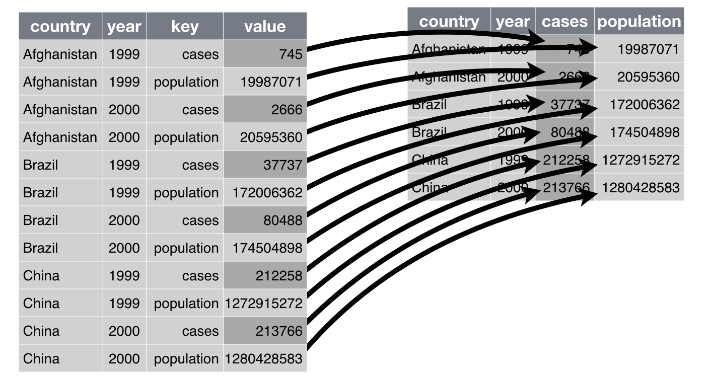

class: center, middle, title-slide

.upper-right[
```{r logo, eval = TRUE, echo = FALSE, out.width = "605px"}
knitr::include_graphics("../../img/cds-101-online-logo.png")
```
]

.lower-right[
```{r cc-by-sa, eval = TRUE, echo = FALSE, out.width = "88px"}
knitr::include_graphics("../../img/cc-by-nc-sa.png")
```

These slides are licensed under a [Creative Commons Attribution-NonCommercial-ShareAlike 4.0 International License](http://creativecommons.org/licenses/by-nc-sa/4.0/).
]

# .font90[Data reshaping]
.title-hline[
## The .mono[pivot_wider()] function
]

```{r setup, include = FALSE}
# DO NOT ALTER THIS CHUNK
source("../../R/xaringan_setup.R")
library(dplyr)
library(tidyr)
library(flair)
name_of_dataset <- tibble(column_one=c("a","a","b","b"), column_two=1:4)

some_other_function <- function(){
  return(name_of_dataset)
}
```

---

# `pivot_wider()`

.footnote[
Source: Figure 12.3 in *R for Data Science* by Garrett Grolemund and Hadley Wickham.
]

.mono[pivot_wider()] takes rows and turns them into columns.

You can think of it as the opposite of the `pivot_longer()` function.

We take a categorical column (each category will become its own column) and a column of values (which will be divided up to become the values of the new columns).

```{r pivot_wider-schematic, out.width = "75%", echo = FALSE}

```

???

We don't often need to make data wider, but it does happen sometimes and so it is useful to know about the pivot_wider() function. This takes a long dataframe with lots of rows and reshapes it into a wider dataframe with lots of columns instead.

Essentially, this is the opposite of the pivot_longer() function.

---

# Structure of `pivot_wide()`

.mono[pivot_wider()] takes rows and turns them into columns.

```{r, echo=FALSE}
decorate('pivot-demo-1') %>%
  flair_funs(background="Coral")
```

```{r pivot-demo-1, include=FALSE, results="hide"}
pivot_wider(
  name_of_dataset,
  names_from = column_one,
  values_from = column_two
)
```

Let's break this down line-by-line...

???

The syntax of the pivot_wider function is similar to pivot_longer, but even simpler.

We are going to take a column of names, and a column of values, and unstack those into a bunch of separate of columns.

---

# Structure of `pivot_wider()`

The first argument we supply to the function is the name of the dataset:

```{r, echo=FALSE}
decorate('pivot-demo-2') %>%
  flair("name_of_dataset")
```

```{r pivot-demo-2, include=FALSE, results="hide"}
pivot_wider(
  name_of_dataset,
  names_from = column_one,
  values_from = column_two
)
```

Remember that as the dataset is the first argument, we can instead pipe the dataset to the function:
```{r, echo=FALSE}
decorate('pivot-demo-3') %>%
  flair("name_of_dataset") %>%
  # flair_funs(background="Coral") %>%
  flair("%>%", background="Aquamarine")
```

```{r pivot-demo-3, echo=FALSE, results="hide"}
some_other_function() %>%
  pivot_wider(
    names_from = column_one,
    values_from = column_two
  )
```

???

First we need to specify the dataset to be reshaped. We can either do this directly, as in the top example, or we can pipe some dataset in from a variable or another function as you see in the bottom example.

When we break a single line of code over many lines, as we have done here, it is often helpful to indent the subsequent lines. This is a good visual cue that makes it much easier to read the code and instantly see that this is all one line of code. RStudio will often indent these line breaks for you, but it doesn't always get it right, so you may need to insert or remove an indent of two spaces as required.

---

# Structure of `pivot_longer()`

```{r, echo=FALSE}
decorate('pivot-demo-5') %>%
  flair_lines(3:4)
```

```{r pivot-demo-5, include=FALSE, results="hide"}
name_of_dataset %>%
  pivot_wider(
    names_from = column_one,
    values_from = column_two
  )
```

The second argument, .mono[names_from], specifies the column which contains the names of the new columns that will create.

The third argument, .mono[values_from], specifies the column which contains the values we will be dividing up into these new columns.

???

The only other information we need to provide are the columns that contain the names of the columns to be unstacked, and the column of values to unstack. The names_from and values_from parameters take these arguments.

Note that these arguments will be existing columns in the dataframe, so we do not put the column names inside quotation marks.

---

# Untidy data example

.qa.center[
**Problem:** Untidy data frame stored in .mono[table2]
]

.font80[
```{r untidy-table2, echo = FALSE}
table2 %>%
  knitr::kable(format = "html")
```
]

???

Let's look at an example of how this works. Why is this dataset not tidy? Pause the video for a moment and see if you can figure out why.

This is an untidy, or messy, dataset because the cases and population variables are mixed up in the same columns.


---

# Untidy data example

<div style="margin-bottom: 10%;"></div>

.answer.center[
**Goal:** Use .mono[pivot_wider] to transform .mono[table2] back to this:
]

<div style="margin-bottom: 5%;"></div>

```{r tidy-table1, echo = FALSE}
table1 %>%
  knitr::kable(format = "html")
```

???

We want to convert the long untidy dataset into a tidy format. We will do this by unstacking the columns that contain the cases and population variables.

Note that we have a column called type, which contains the names of the columns we want to create. We also have a column called count, which contains the values that we want to unstack.

---

# `pivot_wider()` example

<div style="margin-bottom: 5%;"></div>

```r
table2 %>%
  pivot_wider(
    names_from = type,
    values_from = count
  )
```

--

<div style="margin-bottom: 5%;"></div>

```{r tidy-up-table2, echo = FALSE}
table2 %>%
  pivot_wider(
    names_from = type,
    values_from = count
  ) %>%
  knitr::kable(format = "html")
```

???

This is the code that we would use to do this. We tell the pivot_wider function that the new column names are coming from the type column, and the new column values are coming from the count column.

One thing to note again here, is that the original dataframe stored in the table2 will not be modified by running this function. Instead, the pivot_wider function will create a completely new reshaped dataframe. We have not stored that reshaped output dataframe here, merely printed it out on the slide for your viewing pleasure. If you need to save the reshaped dataframe for later use, remember to assign this output to a new variable.

---

# Credits

.left-column[
License

Acknowledgments
]

.right-column[
.font80[[Creative Commons Attribution-NonCommerical-ShareAlike 4.0 International](https://creativecommons.org/licenses/by-nc-sa/4.0/)]

Content adapted from [*R for Data Science*](http://r4ds.had.co.nz) by Garrett Grolemund and Hadley Wickham, [chapter 12](http://r4ds.had.co.nz/tidy-data.html), made available under the [CC BY-NC-ND 3.0 license](http://creativecommons.org/licenses/by-nc-nd/3.0/us/).
]
