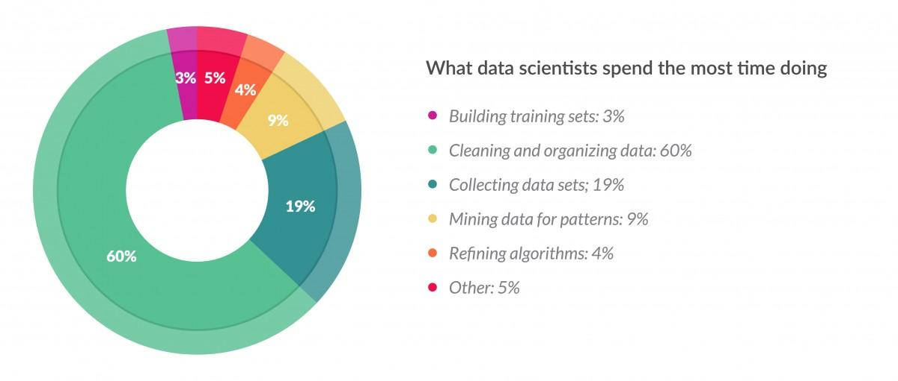
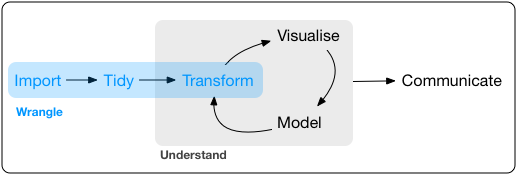
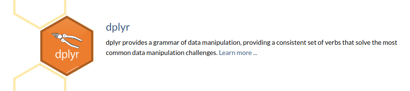

class: center, middle, title-slide

.upper-right[
```{r logo, eval = TRUE, echo = FALSE, out.width = "605px"}
knitr::include_graphics("../../img/cds-101-online-logo.png")
```
]

.lower-right[
```{r cc-by-sa, eval = TRUE, echo = FALSE, out.width = "88px"}
knitr::include_graphics("../../img/cc-by-nc-sa.png")
```

These slides are licensed under a [Creative Commons Attribution-NonCommercial-ShareAlike 4.0 International License](http://creativecommons.org/licenses/by-nc-sa/4.0/).
]

# .font90[Data transformation]
.title-hline[
## What is data wrangling?
]

```{r setup, include = FALSE}
# DO NOT ALTER THIS CHUNK
source("../../R/xaringan_setup.R")
```

---

# The word "wrangle"

<div style="margin-bottom: 10%;"></div>

--

**wrangle**
.quote-container[
> verb
> 
> to tend or round up (cattle, horses, or other livestock).
> .cite[[dictionary.com](http://www.dictionary.com/browse/wrangle)]
]

--

* So, by analogy, "wrangling data" means to collect, clean, and organize digital information (tend and round up)

--

* Informal word, but data scientists will understand what you mean if you use it

--

* In practice, data wrangling requires the use of data transformations to accomplish tasks related to processing, structuring, and analysis.

---

# The word "wrangle"

<div style="margin-bottom: 10%;"></div>

```{r literal-data-wrangling, out.width = "100%", echo = FALSE}

```

.footnote[
Source: [Digital image of a cowboy wrangling data](http://i2.wp.com/rocketsci.azurewebsites.net/wp-content/uploads/2015/07/data-wrangling-1.jpg), Digital image on *likelihoodlog.com*, accessed September 20, 2017, www.likelihoodlog.com/?p=1151
]

---

# `ggplot2` needs clean/tidy datasets

* Datasets such as the `mpg` dataset are small and nicely organized

--

* It would be nice if all datasets were like this! ...but they're the exceptions to the rule

--

* Most raw datasets need cleaning, and this is where data scientists will spend **most** of their time

```{r data-science-time-estimates, out.width="65%", echo = FALSE}

```

.footnote[
Source: [Cleaning Big Data: Most Time-Consuming, Least Enjoyable Data Science Task, Survey Says](https://blogs-images.forbes.com/gilpress/files/2016/03/Time-1200x511.jpg), Digital image on *forbes.com*, accessed September 20, 2017, www.forbes.com/sites/gilpress/2016/03/23/data-preparation-most-time-consuming-least-enjoyable-data-science-task-survey-says/
]

---

# The "data wrangling" pipeline

<div style="margin-bottom: 8%;"></div>

```{r r4ds-data-wrangling-diagram, echo = FALSE}

```

.footnote[
Source: [Data wrangling pipeline](http://r4ds.had.co.nz/diagrams/data-science-wrangle.png), Digital image on *r4ds.had.co.nz*, accessed September 20, 2017, r4ds.had.co.nz/wrangle-intro.html
]

--

* **import** → obtain data and get it into R

--

* **tidy** → reshape rows and columns to follow the [Tidy data rules](http://r4ds.had.co.nz/tidy-data.html)

--

* **transform** → cleaning the dataset (not the same as tidying) as well as "slicing and dicing" the dataset for exploration and analysis.

---

count: false

# The "data wrangling" pipeline

<div style="margin-bottom: 8%;"></div>

```{r r4ds-data-wrangling-diagram, echo = FALSE}
```

.footnote[
Source: [Data wrangling pipeline](http://r4ds.had.co.nz/diagrams/data-science-wrangle.png), Digital image on *r4ds.had.co.nz*, accessed September 20, 2017, r4ds.had.co.nz/wrangle-intro.html
]

* .lightgray[**import** → obtain data and get it into R]

* .lightgray[**tidy** → reshape rows and columns to follow the] <a class="lightgray" href="http://r4ds.had.co.nz/tidy-data.html">Tidy data rules</a>

* .lightgray[**transform** → cleaning the dataset (not the same as tidying)] .red[as well as "slicing and dicing" the dataset for exploration and analysis.]

---

# Meet the dplyr package

<div style="margin-bottom: 20%;"></div>

```{r dplyr-blurb, echo = FALSE, out.width = "100%"}

```

.footnote[
Source: dplyr logo with blurb, Digital image on packages page of *tidyverse.org*, accessed on September 27, 2018, www.tidyverse.org/packages/ 
]

---

# Credits

.left-column[
License
]

.right-column[
.font80[[Creative Commons Attribution-NonCommerical-ShareAlike 4.0 International](https://creativecommons.org/licenses/by-nc-sa/4.0/)]
]
