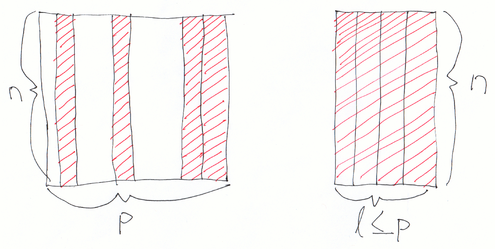

class: center, middle, title-slide

.upper-right[
```{r logo, eval = TRUE, echo = FALSE, out.width = "605px"}
knitr::include_graphics("../../img/cds-101-online-logo.png")
```
]

.lower-right[
```{r cc-by-sa, eval = TRUE, echo = FALSE, out.width = "88px"}
knitr::include_graphics("../../img/cc-by-nc-sa.png")
```

These slides are licensed under a [Creative Commons Attribution-NonCommercial-ShareAlike 4.0 International License](http://creativecommons.org/licenses/by-nc-sa/4.0/).
]

# .font90[Data transformation]
.title-hline[
## The .mono[select] function
]

```{r setup, include = FALSE}
# DO NOT ALTER THIS CHUNK
source("../../R/xaringan_setup.R")
library(ggplot2)
library(dplyr)
```

---

# `select` schematic

.valign-slide[
```{r select-schematic, out.width = "100%", echo = FALSE}

```
]

---

# Structure of the `select` function

<div style="margin-bottom: 25%;"></div>

```r
select(name_of_dataset, column1, column2, ...)
```

Replace .mono[name_of_dataset] with the variable storing your dataset and .mono[column1], .mono[column2], and so on with actual names of the columns you want to keep.

---

# `select` demo

.vhalign-slide[
Follow along in RStudio
]

---

# Credits

.left-column[
License

Acknowledgments
]

.right-column[
.font80[[Creative Commons Attribution-NonCommerical-ShareAlike 4.0 International](https://creativecommons.org/licenses/by-nc-sa/4.0/)]

Ideas and examples for the dplyr demos adapted from *Modern Data Science with R* by Benjamin Baumer, Daniel Kaplan, and Nicholas Horton, chapter 4.
]
