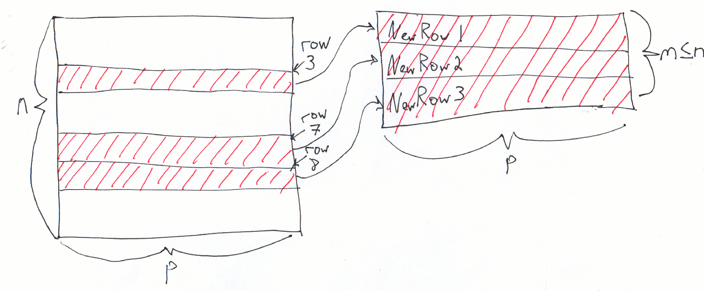

class: center, middle, title-slide

.upper-right[
```{r logo, eval = TRUE, echo = FALSE, out.width = "605px"}
knitr::include_graphics("../../img/cds-101-online-logo.png")
```
]

.lower-right[
```{r cc-by-sa, eval = TRUE, echo = FALSE, out.width = "88px"}
knitr::include_graphics("../../img/cc-by-nc-sa.png")
```

These slides are licensed under a [Creative Commons Attribution-NonCommercial-ShareAlike 4.0 International License](http://creativecommons.org/licenses/by-nc-sa/4.0/).
]

# .font90[Data transformation]
.title-hline[
## The .mono[slice] function
]

```{r setup, include = FALSE}
# DO NOT ALTER THIS CHUNK
source("../../R/xaringan_setup.R")
library(ggplot2)
library(dplyr)
```

---

# `slice` schematic

.vhalign-slide[
```{r slice-schematic, out.width = "100%", echo = FALSE}

```
]

---

# Structure of the `slice` function

<div style="margin-bottom: 15%;"></div>

```r
name_of_dataset %>%
  slice(row_index_start:row_index_end)
```

<div style="margin-bottom: 7%;"></div>

```r
name_of_dataset %>%
  slice(combine(1, 5, 7:11))
```

<div style="margin-bottom: 5%;"></div>

Replace .mono[row_index_start] and .mono[row_index_end] with the integer values for the starting and ending rows you want to get. Alternatively, you can use the .mono[combine] function to specify and grab non-sequential rows, which can include sequential chunks.

---

# `slice` demo

.vhalign-slide[
Follow along in RStudio
]

---

# Credits

.left-column[
License

Acknowledgments
]

.right-column[
.font80[[Creative Commons Attribution-NonCommerical-ShareAlike 4.0 International](https://creativecommons.org/licenses/by-nc-sa/4.0/)]

Ideas and examples for the dplyr demos adapted from *Modern Data Science with R* by Benjamin Baumer, Daniel Kaplan, and Nicholas Horton, chapter 4.
]
