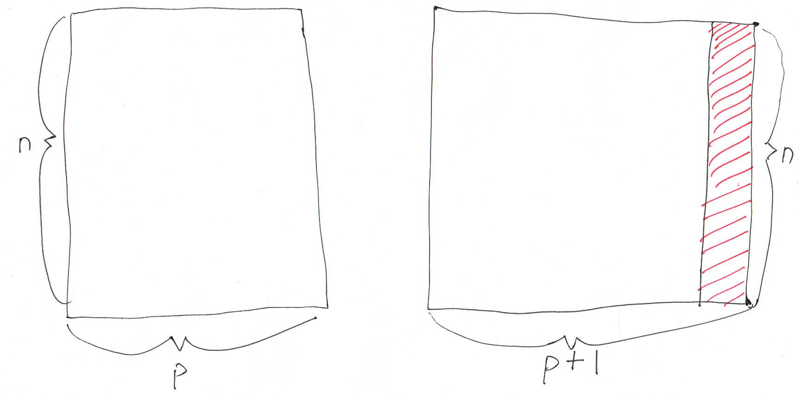

class: center, middle, title-slide

.upper-right[
```{r logo, eval = TRUE, echo = FALSE, out.width = "605px"}
knitr::include_graphics("../../img/cds-101-online-logo.png")
```
]

.lower-right[
```{r cc-by-sa, eval = TRUE, echo = FALSE, out.width = "88px"}
knitr::include_graphics("../../img/cc-by-nc-sa.png")
```

These slides are licensed under a [Creative Commons Attribution-NonCommercial-ShareAlike 4.0 International License](http://creativecommons.org/licenses/by-nc-sa/4.0/).
]

# .font90[Data transformation]
.title-hline[
## The .mono[mutate] function
]

```{r setup, include = FALSE}
# DO NOT ALTER THIS CHUNK
source("../../R/xaringan_setup.R")
library(ggplot2)
library(dplyr)
library(lubridate)
```

---

# `mutate` schematic

.vhalign-slide[
```{r mutate-schematic, out.width = "100%", echo = FALSE}

```
]

---

# Structure of the `mutate` function

<div style="margin-bottom: 12%;"></div>

```r
name_of_dataset %>%
  mutate(
    new_column_name = column_one - column_two
  )
```

<div style="margin-bottom: 7%;"></div>

```r
name_of_dataset %>%
  mutate(
    new_column_name = 2 * (column_one / column_two)
  )
```

<div style="margin-bottom: 5%;"></div>

The above computations to the right of the equals sign are just two examples of the types of calculations you can perform using mutate.

---

# `mutate` arithmetic operations

.valign-slide[
* Many different operators and functions can be used with .mono[mutate]

* **Arithmetic operators:** .mono[+], .mono[-], .mono[*], .mono[/], .mono[^]

* **Modular arithmetic**

  * .mono[%/%]: integer division
    
  * .mono[%%]: remainder
    
* **Logs:** .mono[log()]

* **Logical comparisons:** .mono[<], .mono[<=], .mono[\>], .mono[\>=], .mono[!=]
]

---

# `mutate` demo

.vhalign-slide[
Follow along in RStudio
]

---

# Credits

.left-column[
License

Acknowledgments
]

.right-column[
.font80[[Creative Commons Attribution-NonCommerical-ShareAlike 4.0 International](https://creativecommons.org/licenses/by-nc-sa/4.0/)]

Ideas and examples for the dplyr demos adapted from *Modern Data Science with R* by Benjamin Baumer, Daniel Kaplan, and Nicholas Horton, chapter 4.
]
