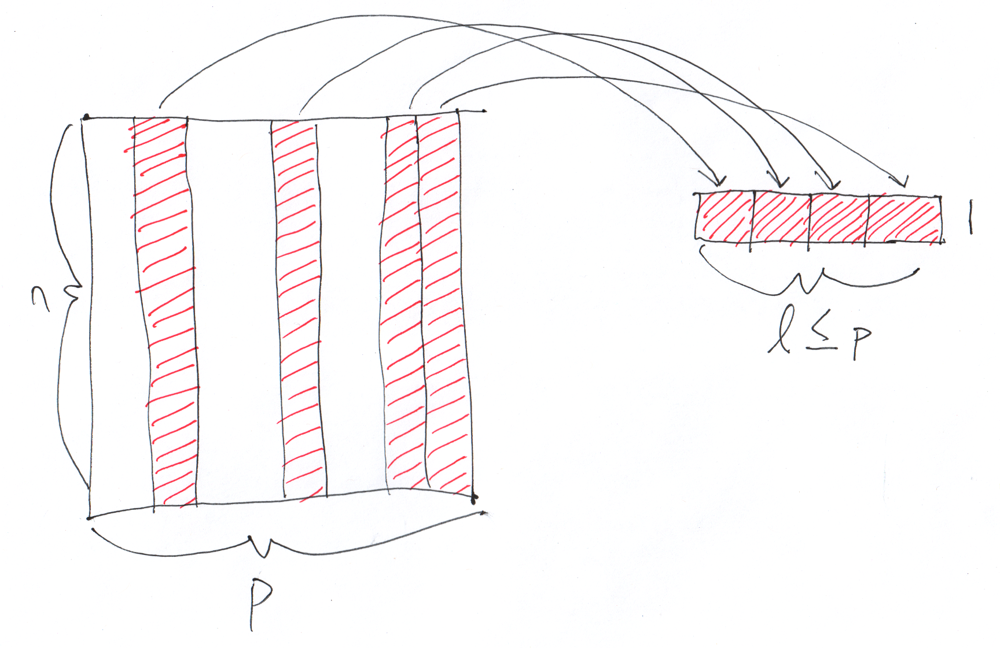

class: center, middle, title-slide

.upper-right[
```{r logo, eval = TRUE, echo = FALSE, out.width = "605px"}
knitr::include_graphics("../../img/cds-101-online-logo.png")
```
]

.lower-right[
```{r cc-by-sa, eval = TRUE, echo = FALSE, out.width = "88px"}
knitr::include_graphics("../../img/cc-by-nc-sa.png")
```

These slides are licensed under a [Creative Commons Attribution-NonCommercial-ShareAlike 4.0 International License](http://creativecommons.org/licenses/by-nc-sa/4.0/).
]

# .font90[Data transformation]
.title-hline[
## The .mono[group_by] and .mono[summarize] functions
]

```{r setup, include = FALSE}
# DO NOT ALTER THIS CHUNK
source("../../R/xaringan_setup.R")
library(ggplot2)
library(dplyr)
library(lubridate)
```

---

# `group_by` and `summarize` schematic

.vhalign-slide[
```{r summarize-schematic, out.width = "100%", echo = FALSE}

```
]

---

# .font70[Structure of the group\_by and summarize functions]

<div style="margin-bottom: 17%;"></div>

```r
name_of_dataset %>%
  group_by(column_one, column_three) %>%
  summarize(
    count = n(),
    summation = sum(column_two)
  )
```

The above .mono[summarize] operations on the right of the equals signs are just two examples of the types of data aggregations you can perform.

---

# `summarize` operations

<div style="margin-bottom: 15%;"></div>

The following are a few examples of the types of data aggregation that you can perform using .mono[summarize].

* .mono[n()]: Counts number of rows in a group

* .mono[sum()]: For numerical variables, sums rows within a group

* **statistical**: .mono[mean()], .mono[median()], .mono[sd()], .mono[min()], .mono[max()]

* Counts and proportions of logical values: .mono[sum(x \> 10)], .mono[mean(y == 0)]

---

# `group_by` and `summarize` demo

.vhalign-slide[
Follow along in RStudio
]

---

# Credits

.left-column[
License

Acknowledgments
]

.right-column[
.font80[[Creative Commons Attribution-NonCommerical-ShareAlike 4.0 International](https://creativecommons.org/licenses/by-nc-sa/4.0/)]

Ideas and examples for the dplyr demos adapted from *Modern Data Science with R* by Benjamin Baumer, Daniel Kaplan, and Nicholas Horton, chapter 4.
]
