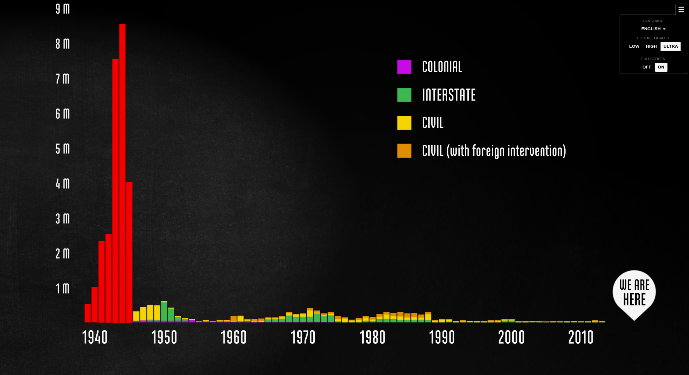
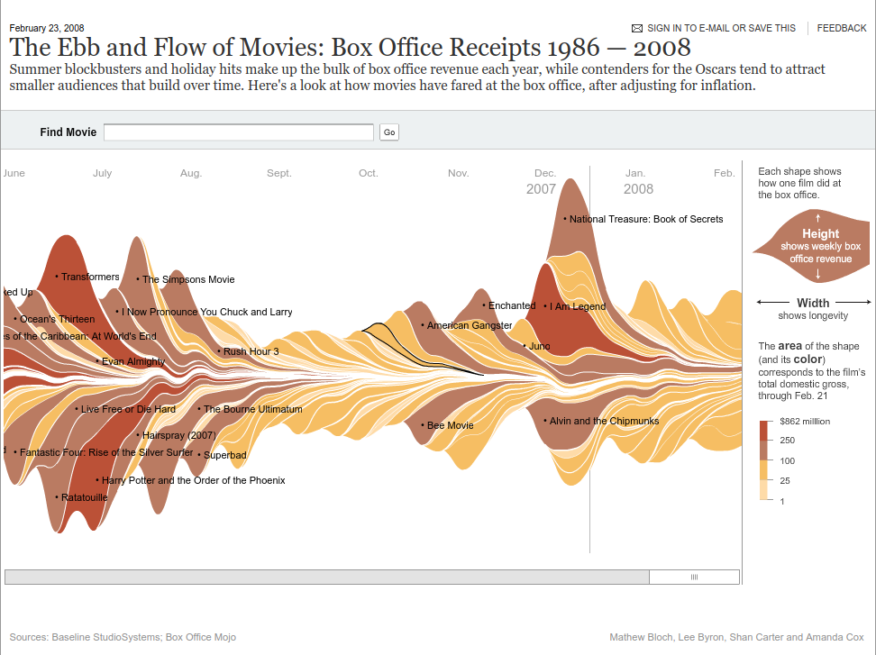
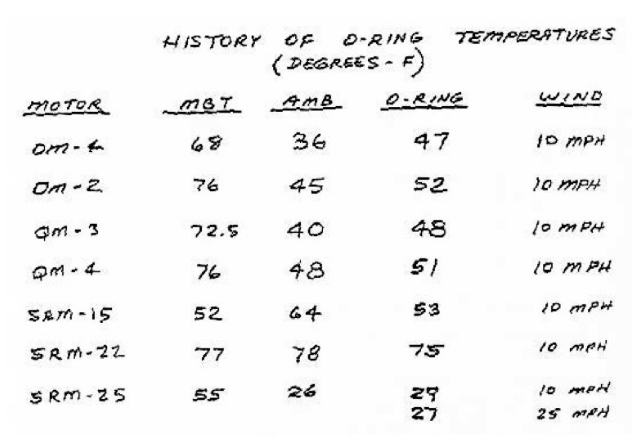
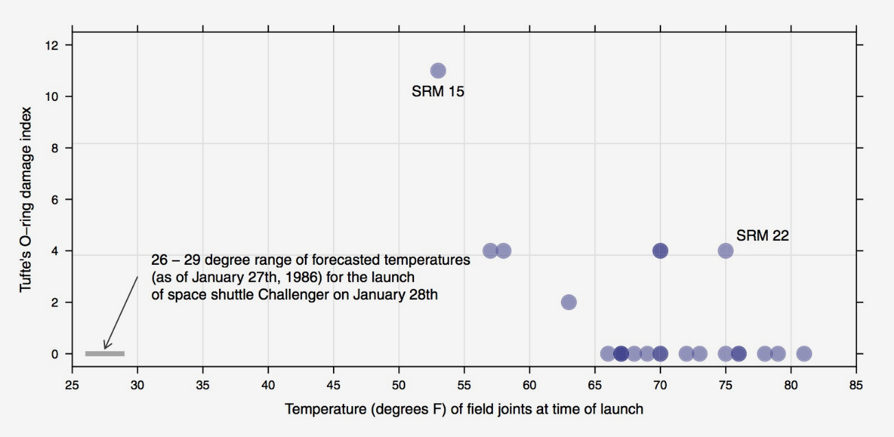
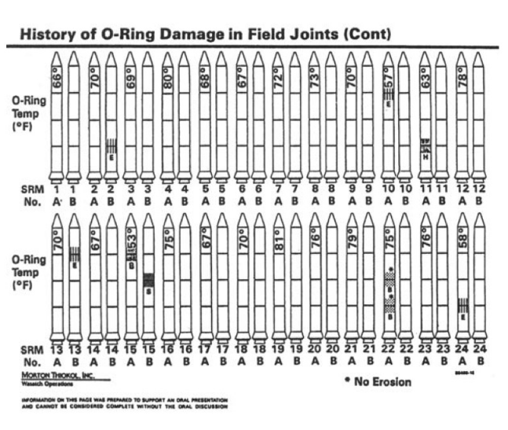
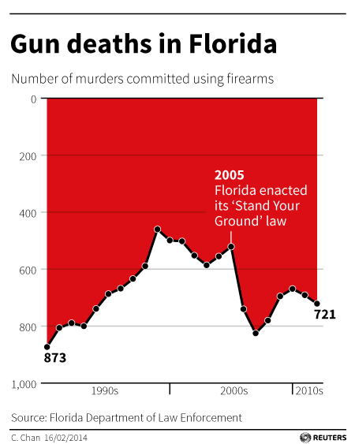
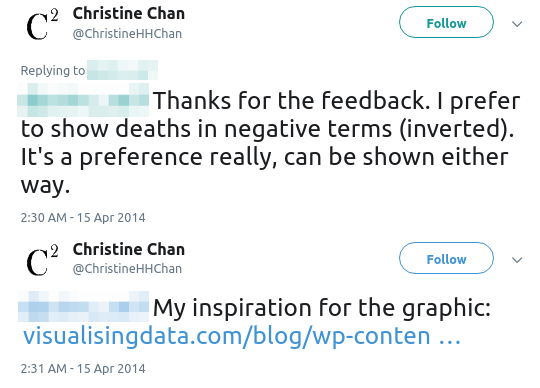
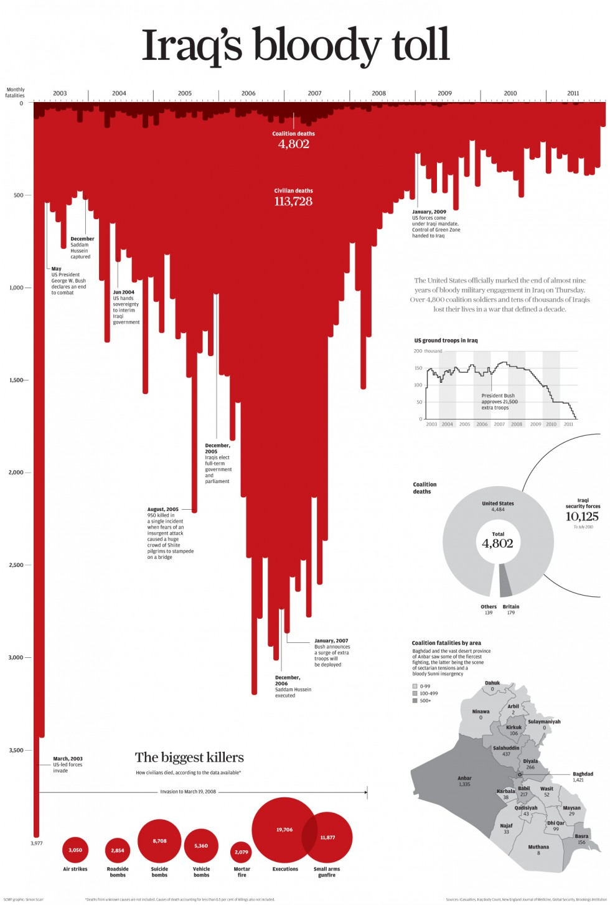
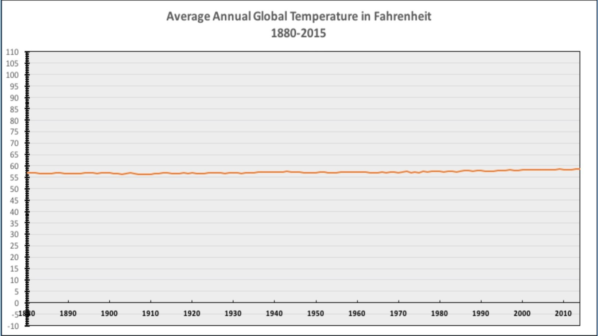
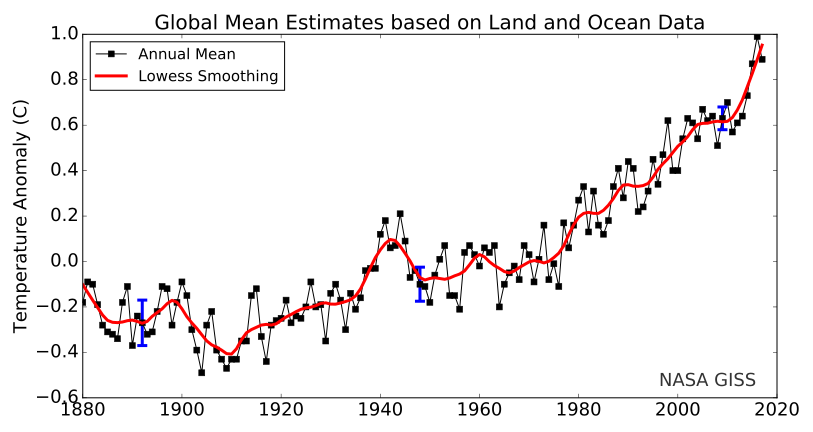

class: center, middle, title-slide

.upper-right[
```{r logo, eval = TRUE, echo = FALSE, out.width = "605px"}
knitr::include_graphics("../../img/cds-101-online-logo.png")
```
]

.lower-right[
```{r cc-by-sa, eval = TRUE, echo = FALSE, out.width = "88px"}
knitr::include_graphics("../../img/cc-by-nc-sa.png")
```

These slides are licensed under a [Creative Commons Attribution-NonCommercial-ShareAlike 4.0 International License](http://creativecommons.org/licenses/by-nc-sa/4.0/).
]

# .font90[Data visualization]
.title-hline[
## Data visualization as communication
]

```{r setup, include = FALSE}
# DO NOT ALTER THIS CHUNK
source("../../R/xaringan_setup.R")
library(ggplot2)
```

---

# Why is data visualization important?

.quote-container[
> Nothing in science has any value to society if it is not communicated, and scientists are beginning to learn their social obligations.
.cite[Anne Roe, *The Making of a Scientist* (1953)]
]

--

.quote-container[
> If you cannot - in the long run - tell everyone what you have been doing, your doing has been worthless.
.cite[Erwin Schrodinger (Nobel Prize winner in physics)]
]

--

.quote-container[
> The greatest value of a picture is when it forces us to notice what we never expected to see.
.cite[John Tukey (Mathematician, recipient of National Medal of Science)]
]

--

.quote-container[
> Numbers have an important story to tell. They rely on you to give them a clear and convincing voice.
.cite[Stephen Few (Founder of [Perceptual Edge](https://www.perceptualedge.com), author of *Show Me the Numbers*)]
]

--

.quote-container[
> Visualizations act as a campfire around which we gather to tell stories.
.cite[Al Shalloway (Founder and CEO of [Net Objectives](http://www.netobjectives.com))]
]

---

# .font90[Effective presentations ↔ effective visuals]

```{r steve_jobs, out.width = "80%", echo = FALSE}

```

.footnote[
Source: [Digital Image](https://static6.businessinsider.com/image/52b86ad769bedd9b32759577-1200/steve-jobs-iphone.jpg), *AP* photo used on *Business Insider*, accessed September 10, 2017. www.businessinsider.com/the-first-iphone-2013-12.
]

---

# .font90[Visualizations can lead to comprehension...]

<div style="margin-bottom: 10%;"></div>

```{r fallen_ww2, out.width = "95%", echo = FALSE}

```

.footnote[
Source: The Fallen of World War II, www.fallen.io/ww2/
]

---

# ...or to confusion

```{r nytimes_movies, out.width = "80%", echo = FALSE}

```

.footnote[
Source: Bloch, Mathew. "The Ebb and Flow of Movies - Box Office Receipts 1986 — 2008." *New York Times*, Lee Bryon, Shan Carter, Amanda Cox, 23 Feb. 2008. www.nytimes.com/interactive/2008/02/23/movies/20080223_REVENUE_GRAPHIC.html.
]

---

<h1 style="margin-bottom: 15%;">Poor visualizations may lead to tragedy</h1>

*   The *Challenger* disaster, January 28th, 1986

--

*   The Space Shuttle Challenger broke apart 73 seconds into flight, all seven crew members died

--

*   The rubber O-rings, which held the rockets together, had failed due to the low temperatures (below 30°F)

--

*   Engineers at Morton Thiokol, who supplied solid rocket motors to NASA, warned about this on January 27th, 1986 in a conference call

--

*   NASA and the managers at Morton Thiokol overruled their concerns, unpersuaded by the engineers

---

# .font90[The engineers presented tables like this one]

<div style="margin-bottom: 7%;"></div>

```{r o-rings_chart, out.width = "600px", echo = FALSE}

```

.footnote[
Source: Figure 2.18(a) in *Modern Data Science with R* by Benjamin Baumer, Daniel Kaplan, and Nicholas Horton.
]

---

# .font80[Edward Tufte's critique of the Challenger disaster]

Mathematician Edward Tufte issued a critique and argued that the data should have been presented this way:

```{r tufte-challenger, out.width = "750px", echo = FALSE}

```

.footnote[
Source: Figure 2.17 in *Modern Data Science with R* by Benjamin Baumer, Daniel Kaplan, and Nicholas Horton.
]

---

# .font80["Chartjunk" in Challenger Congressional Hearings]

This information was presented in Congressional Hearings about the incident in this format:

```{r challenger_congress, out.width = "450px", echo = FALSE}

```

.footnote[
Source: Figure 2.18(b) in *Modern Data Science with R* by Benjamin Baumer, Daniel Kaplan, and Nicholas Horton.
]

---

# *How to Lie with Statistics*

<div style="margin-bottom: 15%;"></div>

Book by Darrell Huff, published in 1954

<div style="margin-bottom: 6%;"></div>

--

* The title is tongue-in-cheek and is usually misunderstood. The book is not a guide for or about "fudging the numbers" with statistics.

--

* Illustrates ways that visualizations can be manipulated such that they are misleading, but technically show accurate information

<div style="margin-bottom: 6%;"></div>

--

.answer.center[
**General method:** Violate conventions and expectations
]

---

# .font90[Example 1: gun deaths in Florida over time]

.pull-left[
<div style="margin-bottom: 12%;"></div>

**Context**<br>
Florida passed a "Stand Your Ground" law in 2005.

Advocates claimed it would reduce crime, opponents argued it would increase use of lethal force

<div style="margin-bottom: 15%;"></div>
]

---

count: false

# .font90[Example 1: gun deaths in Florida over time]

.footnote[
Source: Chen, Christine. "Gun deaths in Florida." *Reuters*, 16 Feb. 2014. graphics.thomsonreuters.com/14/02/US-FLORIDA0214.gif.
]

.pull-left[
<div style="margin-bottom: 12%;"></div>

**Context**<br>
Florida passed a "Stand Your Ground" law in 2005.

Advocates claimed it would reduce crime, opponents argued it would increase use of lethal force

<div style="margin-bottom: 15%;"></div>

.qa[
If you wanted to use data to answer this question, and you came across this graphic published by the news organization Reuters, what would you conclude?
]
]

.pull-left[
```{r reuters_florida, out.width = "90%", echo = FALSE, fig.align="right"}

```
]

---

# .font90[Example 1: gun deaths in Florida over time]

.pull-left[
<div style="margin-bottom: 12%;"></div>

The image's creator posted on Twitter to explain her design choices for the visualization.

```{r cchan-tweets-gun-deaths-image, out.width = "95%", echo = FALSE}

```
]

.pull-right[
```{r iraqs-bloody-tool, out.width = "75%", echo = FALSE}

```
]

.footnote[
Sources: @ChristineHHChan, *Twitter*, 15 Apr. 2014, 2:30 a.m., twitter.com/ChristineHHChan/status/455971447169511424.; @ChristineHHChan, *Twitter*, 15 Apr. 2014, 2:31 a.m., twitter.com/ChristineHHChan/status/455971685783441408.; Scarr, Simon. "Iraq's bloody toll." *South China Morning Post*, 17 Dec. 2011. scmp.com/infographics/article/1284683/iraqs-bloody-toll.
]

---

# .font80[Example 2: average global temperature over time]

.footnote[
Source: "Average Annual Global Temperature in Fahrenheit." *Powerline*, Steven Hayward, Global-2-copy, 21 Oct. 2015. www.powerlineblog.com/archives/2015/10/the-only-global-warming-chart-you-need-from-now-on.php.
]

The political/editorial magazine National Review [tweeted the following visualization](https://twitter.com/NRO/status/676516015078039556) on December 14, 2015. 

```{r nro_powerline_temperatures, out.width = "85%", echo = FALSE}

```

---

count: false

# .font80[Example 2: average global temperature over time]

<div style="margin-bottom: 7%;"></div>

Here's a conventional plot of the average global temperature data

```{r nasa_goddard_temperatures, out.width = "85%", echo = FALSE}

```

.footnote[
Source: "Global Mean Estimates based on Land and Ocean Data." NASA Goddard Institute for Space Studies, Sep. 2018. data.giss.nasa.gov/gistemp/graphs/.
]

---

# .font60[Side note: How do we have a record going back to the 1880s?]

.valign-slide[
Temperatures from the 1800s and onward were recorded using thermometers at various locations around the globe, and by the 1880s thermometers had become precise.
Systematic measurements began around the mid-1800s at various army posts, and in 1891 the National Weather Service was formed to continue the effort.
]

.footnote[
Source: National Oceanic and Atmospheric Administration. "How do we observe today's climate?", www.climate.gov/maps-data/primer/measuring-climate.
]

---

# .font80[Principles and ethics for scientific visualizations]

<div style="margin-bottom:10%;"></div>

1.  Present your results transparently and honestly

--

2.  Show all data, including outliers, that are valid measurements

--

3.  Use graph layouts that show trends and lets readers easily read quantitative values

--

4.  Do not break conventions regarding scaling, axis orientation, the type of plot to use, etc.

--

5.  If you leave something out of a visualization, say so and justify it

--

6.  Strongly consider including your datasets and any scripts used to create figures with your reports or journal articles

---

# Credits

.left-column[
License

Acknowledgments
]

.right-column[
.font80[[Creative Commons Attribution-NonCommerical-ShareAlike 4.0 International](https://creativecommons.org/licenses/by-nc-sa/4.0/)]

Illustrative examples (*Challenger* disaster, *How to Lie with Statistics*, Gun deaths in Florida, average global temperatures) and **principles and ethics for scientific visualizations** adapted from *Modern Data Science with R* by Benjamin Baumer, Daniel Kaplan, and Nicholas Horton, chapters 2 and 6.
]
