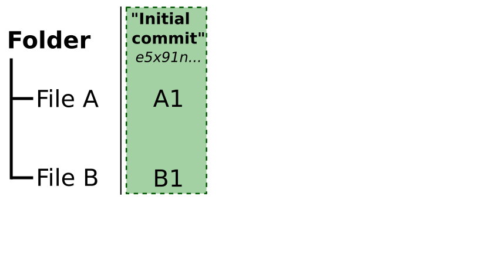
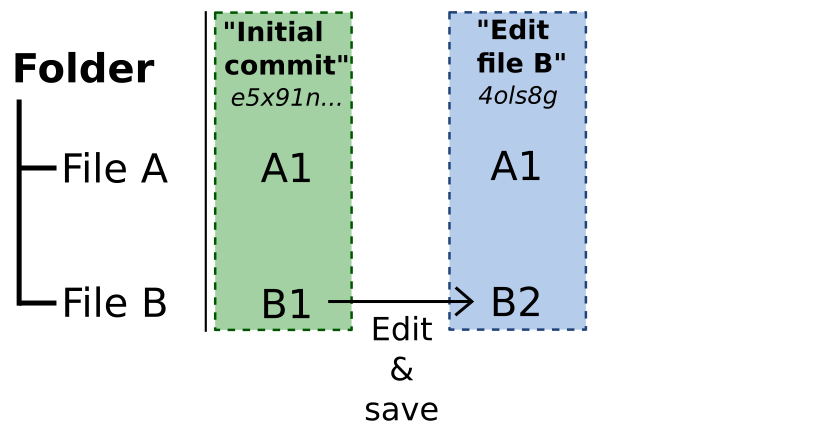
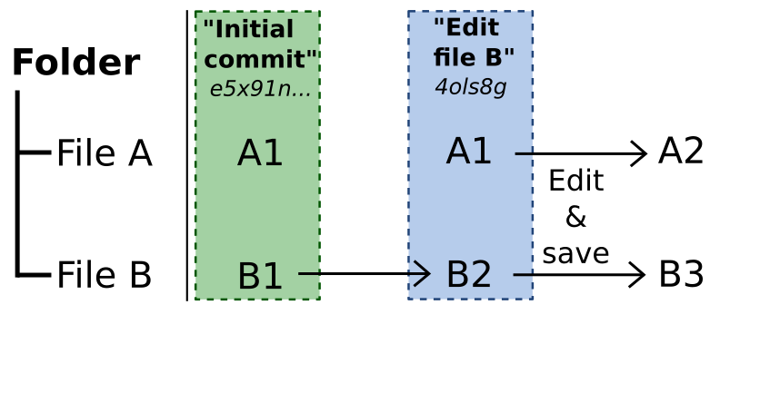
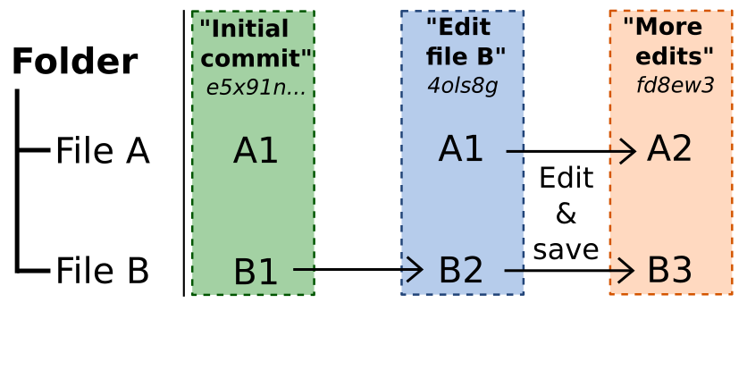
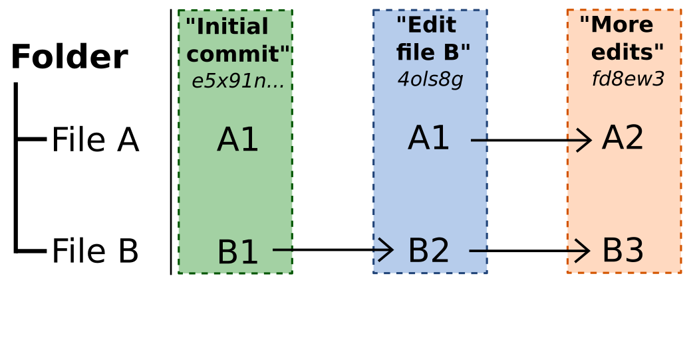
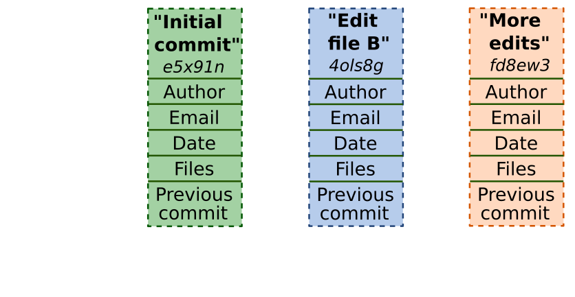

class: center, middle, title-slide

.upper-right[
```{r logo, echo = FALSE, out.width = "605px"}
knitr::include_graphics("../../img/cds-101-logo-slides-no-icon.png")
```
]

.lower-right[
```{r cc-by-sa, echo = FALSE, out.width = "88px"}
knitr::include_graphics("../../img/cc-by-nc-sa.png")
```

These slides are licensed under a [Creative Commons Attribution-NonCommercial-ShareAlike 4.0 International License](http://creativecommons.org/licenses/by-nc-sa/4.0/).
]

# .font90[Git]
.title-hline[
## Commits
]

```{r setup, include = FALSE}
# DO NOT ALTER THIS CHUNK
source("../../R/xaringan_setup.R")
library(tidyverse)
library(git2r)
```

---

# What is a commit?

```{r git_fs_1, echo = FALSE, out.width = "700px"}

```

Your project contains files, which Git tracks.

---

# What is a commit?

```{r git_fs_2, echo = FALSE, out.width = "700px"}

```

When the project starts, each of these files has particular contents.

Let us call these versions of the files A1 and B1.

---

# What is a commit?

```{r git_fs_3, echo = FALSE, out.width = "700px"}

```

After saving these files to your hard-drive, you can tell Git to take a snapshot of the project (and all the files it is tracking) at that moment in time.

You supply a message describing the state of the files, and Git makes a backup of the files in this state. It gives you a random identifier, called a **hash**, to refer to the state of the files at this commit. In this case, this hash begins *e5x91n...*

---

# What is a commit?

```{r git_fs_4, echo = FALSE, out.width = "700px"}

```

After some edits, File B now has different contents.

Let us call the new version of the file B2.

---

# What is a commit?

```{r git_fs_5, echo = FALSE, out.width = "700px"}

```

We can take another snapshot of the project's files in this new state. We supply a commit message that describes the changes, and Git creates more backups of any changed files.

This commit has a new hash, beginning *4ols8g...*

---

# What is a commit?

```{r git_fs_6, echo = FALSE, out.width = "700px"}

```

After yet more edits, both files contain changes...

---

# What is a commit?

```{r git_fs_7, echo = FALSE, out.width = "700px"}

```

After yet more edits, both files contain changes...

...which we can take a snapshot of in a third commit, *fd8ew3...*

---

# What is a hash?

A **hash** is a function that turns a piece of data (of any size) into a different piece of data of a fixed size.

The `git2r` package contains the same hash function used by Git:

```{r}
hash("Dominic White")
```

--

A single character can make a big difference:

```{r}
hash("Domjnic White")
```


---

# What data does Git hash in a commit?

```{r git_commit, echo = FALSE, out.width = "700px"}

```

---

# The hash of the first commit

```{r git_commit-1, echo = FALSE, out.width = "700px"}

```

---

# The hash of the first commit

```{r git_commit_hash, echo = FALSE, out.width = "700px"}

```

---

# A sequence of commits

```{r git_commit_chain_fw, echo = FALSE, out.width = "700px"}

```

Each commit contains changes that build on the previous commit.

---

# A sequence of snapshots

```{r git_commit_chain_contents, echo = FALSE, out.width = "700px"}

```

Each commit is a snapshot that records the state of the project at that moment.

---

# Git history as a backwards chain

```{r git_commit_chain_bw, echo = FALSE, out.width = "700px"}

```

We build up a chain of commits that record the history of changes to the project. Each commit links back to its predecessor.

This history is immutable (unchangeable): we cannot change a single piece of data in any of the commits without changing the hash of that commit and any subsequent commits.

---

# Summary

Two key take-aways:

* A commit is a snapshot of all the files in a project at a point in time.

* Each commit keeps a record of the previous commit in the sequence, allowing us to build a sequence of commits that record the history of a project.

---

# Credits

.left-column[
License
]

.right-column[
.font80[[Creative Commons Attribution-NonCommerical-ShareAlike 4.0 International](https://creativecommons.org/licenses/by-nc-sa/4.0/)]
]
