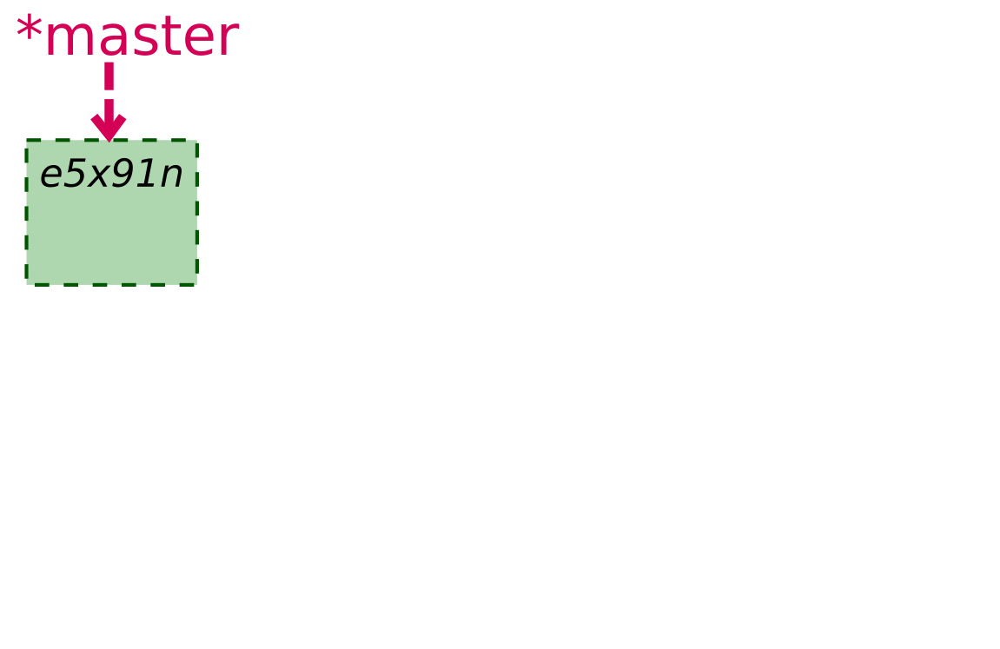
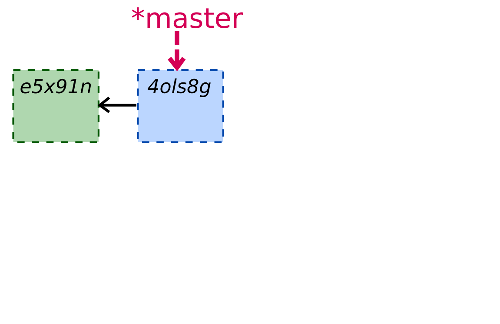
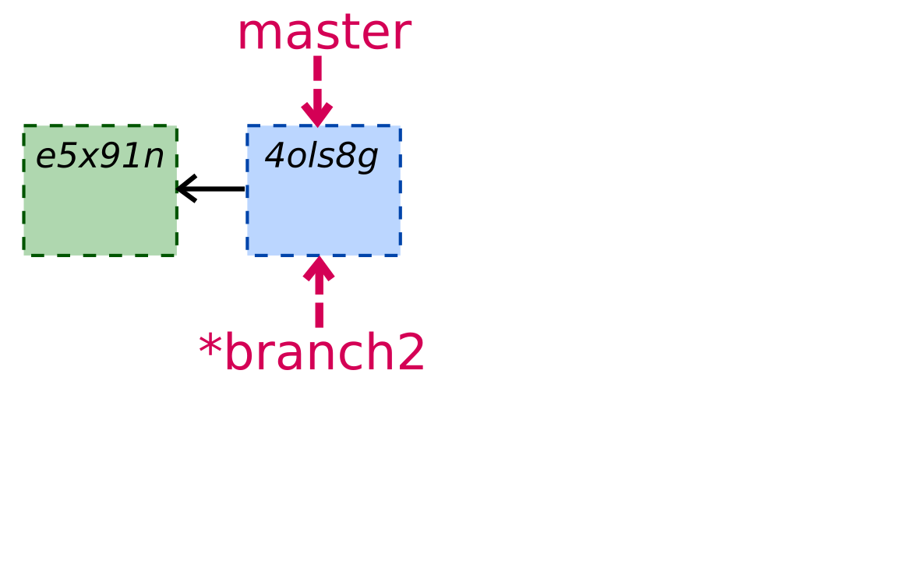
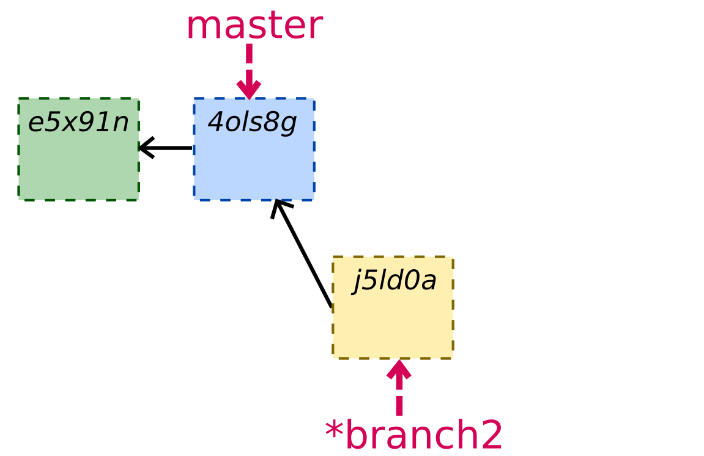
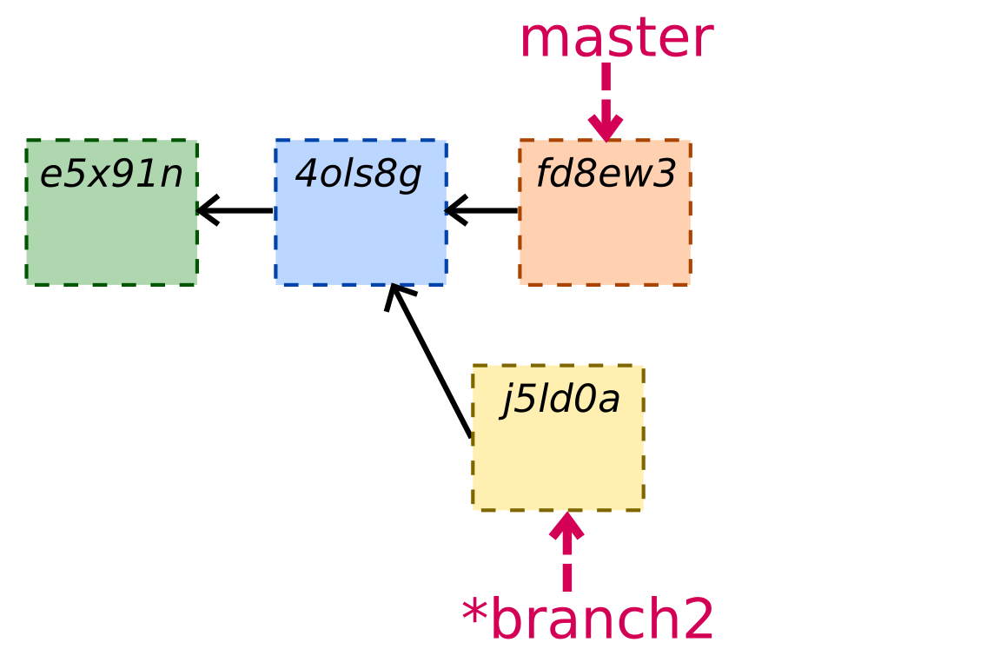
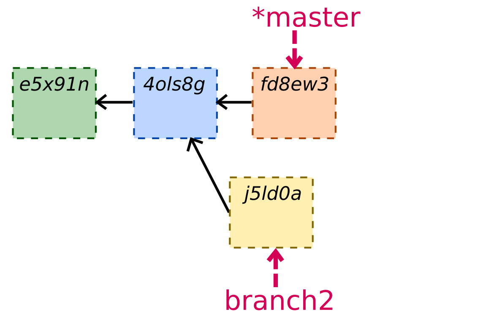
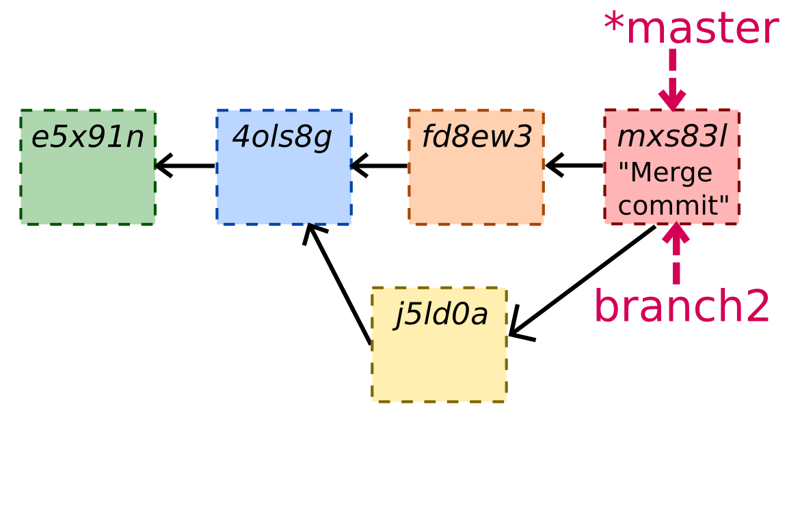

class: center, middle, title-slide

.upper-right[
```{r logo, echo = FALSE, out.width = "605px"}
knitr::include_graphics("../../img/cds-101-logo-slides-no-icon.png")
```
]

.lower-right[
```{r cc-by-sa, echo = FALSE, out.width = "88px"}
knitr::include_graphics("../../img/cc-by-nc-sa.png")
```

These slides are licensed under a [Creative Commons Attribution-NonCommercial-ShareAlike 4.0 International License](http://creativecommons.org/licenses/by-nc-sa/4.0/).
]

# .font90[Git]
.title-hline[
## Branches
]

```{r setup, include = FALSE}
# DO NOT ALTER THIS CHUNK
source("../../R/xaringan_setup.R")
```

---

# The problem with projects

* `homework.docx`

--

* `homework_v2.docx`

--

* `homework_v2_final.docx`

--

* `homework_v2_final_plus_moms_suggestions.docx`

--

* `homework_v3_FINAL_FINAL.docx`

--

* `homework_v4_ABSOLUTELY_FINAL_AAARGH.docx`

* ...

---
  
# Git to the rescue

Version control systems allow you to switch between different versions of a file.

With Git, you can move backwards and forwards along a chain of sequential commits.

You can also move sideways between versions that exist simultaneously, using **branches**.

---

# Git branches

```{r, echo = FALSE, out.width = "700px"}

```

---

# Git branches

```{r, echo = FALSE, out.width = "700px"}

```

---

# Git branches

```{r, echo = FALSE, out.width = "700px"}

```

---

# Git branches

```{r, echo = FALSE, out.width = "700px"}

```

---

# Git branches

```{r, echo = FALSE, out.width = "700px"}

```

---

# Git branches

```{r, echo = FALSE, out.width = "700px"}

```

---

# Git branches

```{r, echo = FALSE, out.width = "700px"}

```


---

# How files are merged

.pull-left[
**Branch 1**

*File A:*
```
Line 1
Line 2
Line 3
```
]
--
.pull-right[
**Branch 2**

*File A:*
```
Line 1
Line 2
Line 3
```
]

---

# How files are merged

.pull-left[
**Branch 1**

*File A:*
```
Bob Smith
Line 2
Line 3
```
]

.pull-right[
**Branch 2**

*File A :*
```
Line 1
Line 2
Dominic White
```
]

--

<br>

**After merge**

*File A:*
```
Bob Smith
Line 2
Dominic White
```

---

# Merge conflict

.pull-left[
**Branch 1**

*File A:*
```
---
title: "Project 1"
author: "Your Name"
```
]

.pull-right[
**Branch 2**

*File A :*
```
---
title: "Project 1"
author: "Your Name"
```
]

---

# Merge conflict

.pull-left[
**Branch 1**

*File A:*
```
---
title: "Project 1"
author: "Dominic White"
```
]

.pull-right[
**Branch 2**

*File A :*
```
---
title: "Project 1"
author: "Bob Smith"
```
]

---

# Merge conflict


*Conflict resolution markers inserted into File A:*
```
---
title: "Project 1"
<<<<<< branch1
author: "Dominic White"
======
author: "Bob Smith"
>>>>>> branch2
```

--


.pull-left[

*One solution:*
```
---
title: "Project 1"
author: "Dominic White"
```
]

--

.pull-right[

*Alternatively*
```
---
title: "Project 1"
author:
  - "Dominic White"
  - "Bob Smith"
```
]


---

# Credits

.left-column[
License
]

.right-column[
.font80[[Creative Commons Attribution-NonCommerical-ShareAlike 4.0 International](https://creativecommons.org/licenses/by-nc-sa/4.0/)]
]
