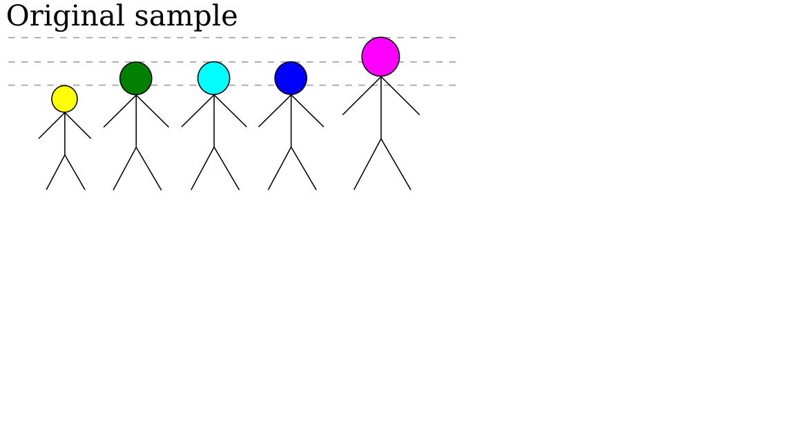
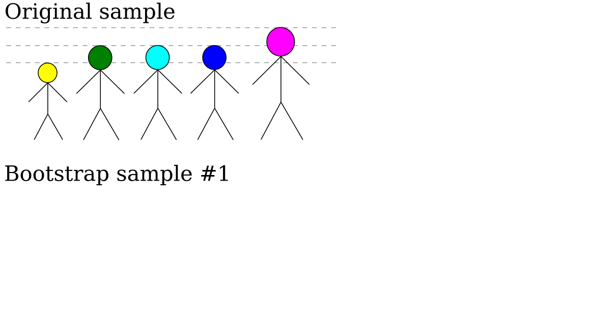
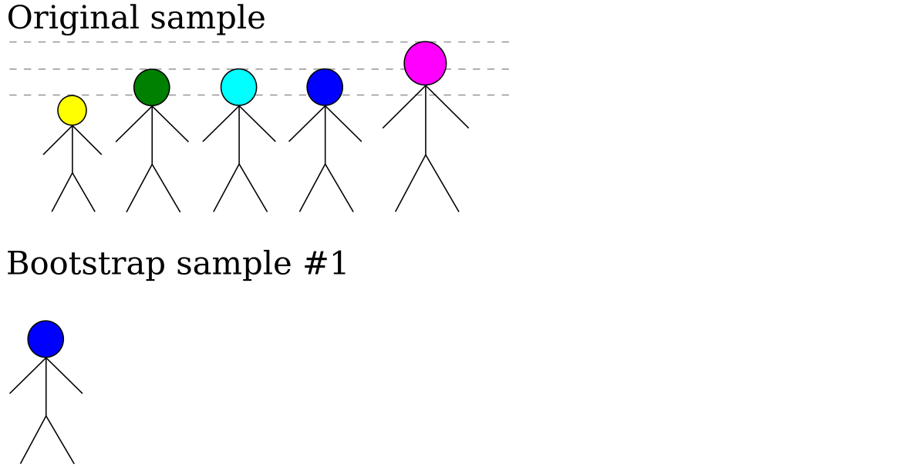
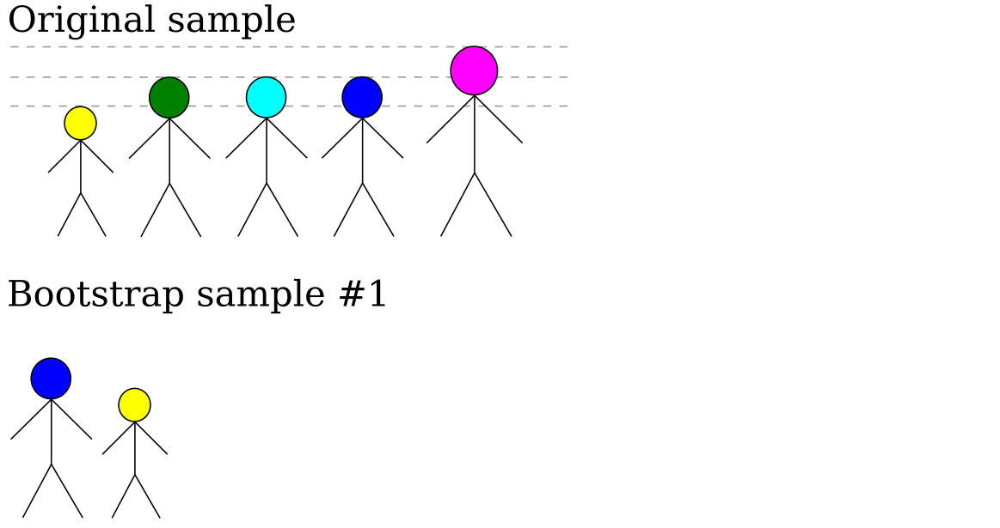
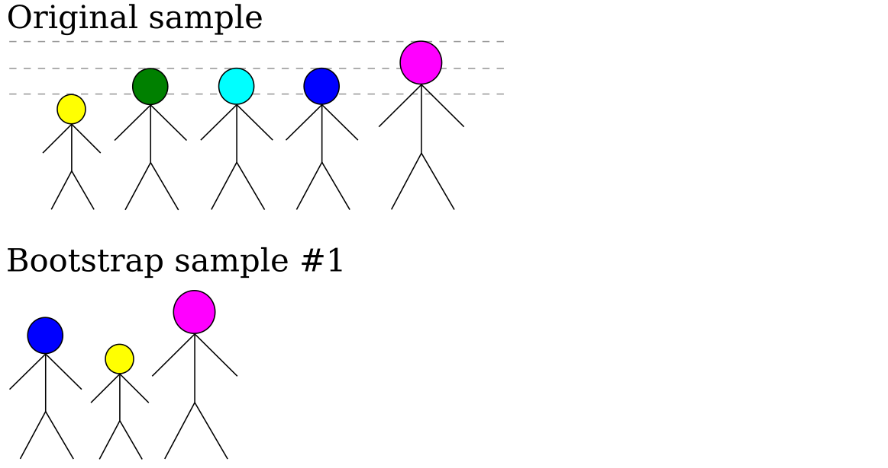
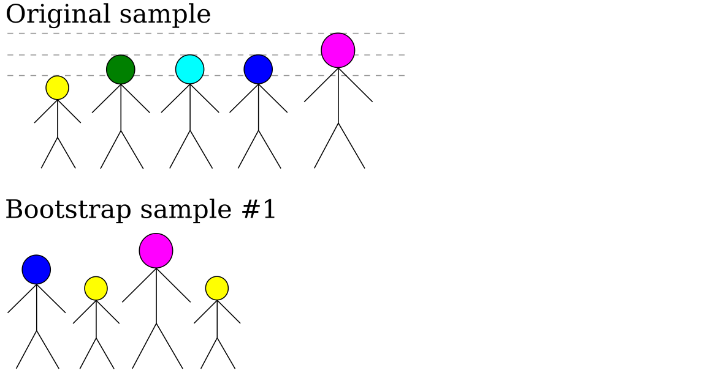
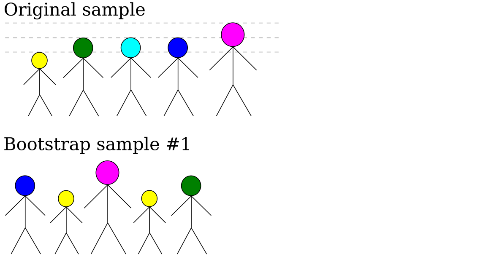
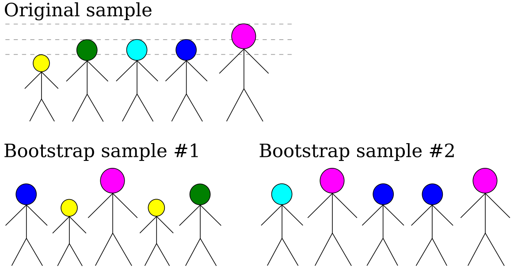

class: center, middle, title-slide

.upper-right[
```{r logo, echo = FALSE, out.width = "605px"}
knitr::include_graphics("../../img/cds-101-logo-slides-no-icon.png")
```
]

.lower-right[
```{r cc-by-sa, echo = FALSE, out.width = "88px"}
knitr::include_graphics("../../img/cc-by-nc-sa.png")
```

These slides are licensed under a [Creative Commons Attribution-NonCommercial-ShareAlike 4.0 International License](http://creativecommons.org/licenses/by-nc-sa/4.0/).
]

# .font90[Advanced Inference]
.title-hline[
## Confidence intervals
]

```{r setup, include = FALSE}
# DO NOT ALTER THIS CHUNK
source("../../R/xaringan_setup.R")
```

---

# Margin of error

When we estimate something about a population, we are (by definition) inaccurate.

If we try to estimate the height of all GMU students from a random sample, we will almost certainly be slightly wrong.

In fancier language, we can say that the *sample mean* is an approximation of the *population mean*.

The question is: how approximate?

--

We can provide a margin of error around our estimate of height (or any other statistic).

This range of plausible values is called a **confidence interval**.

---

# Parameter estimation

Image that we take multiple random samples of GMU students.

.qa[
Will the average height of each sample (the "sample mean") be the same, somewhat different, or very different?
]

--

.answer[
Not the same, but only somewhat different.
]

We could estimate the confidence interval by taking lots of random samples.

But it would be easier if we only had to take one sample...

---

# Resampling

How can we fake taking multiple samples?

--

We can sample from our sample.

* Creating artificial samples from a single real sample is called "resampling". 

* We have already used the permutation method of resampling to do hypothesis tests with the `infer` package.

* To calculate the confidence interval, we are going to use a resampling technique called **the bootstrap**.

---

# The bootstrap

```{r, echo = FALSE, out.width = "700px"}

```

---

# The bootstrap

```{r, echo = FALSE, out.width = "700px"}

```

---

# The bootstrap

```{r, echo = FALSE, out.width = "700px"}

```

---

# The bootstrap

```{r, echo = FALSE, out.width = "700px"}

```

---

# The bootstrap

```{r, echo = FALSE, out.width = "700px"}

```

---

# The bootstrap

```{r, echo = FALSE, out.width = "700px"}

```

---

# The bootstrap

```{r, echo = FALSE, out.width = "700px"}

```

---

# The bootstrap

```{r, echo = FALSE, out.width = "700px"}

```

--

.pull-left[
&nbsp;&nbsp;&nbsp;&nbsp;&nbsp;&nbsp;&nbsp;&nbsp;Lower mean height.
]

.pull-right[
Greater mean height
]
---

# From bootstrap to confidence intervals

We typically report confidence intervals as a percentage, e.g. a 95% confidence interval.

A 95% confidence interval means: if we always calculate the C.I. whenever we calculate a statistic, then the true value will lie within the C.I. 95% of the time.

--

If we generate a large number of bootstrap samples, then we can estimate the confidence interval as the range in which 95% of the sample means lie within.

For example, imagine that we generated 10,000 bootstrap samples of height. The minimum of the C.I. range would be from the the 2.5-th percentile bootstrap sample to the 97.5-th sample.

When reporting the statistic, we should report not only the mean of the original sample, but also the confidence interval, e.g.
  
> The mean height is 5'8" ± 8" (95% confidence interval).

---

# Credits

.left-column[
License

Acknowledgments
]

.right-column[
.font80[[Creative Commons Attribution-NonCommerical-ShareAlike 4.0 International](https://creativecommons.org/licenses/by-nc-sa/4.0/)]

Adapted from slides by James Glasbrenner.
]
