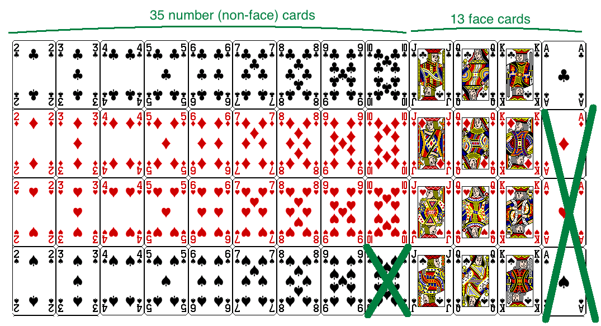

class: center, middle, title-slide

.upper-right[
```{r logo, echo = FALSE, out.width = "605px"}
knitr::include_graphics("../../img/cds-101-online-logo.png")
```
]

.lower-right[
```{r cc-by-sa, echo = FALSE, out.width = "88px"}
knitr::include_graphics("../../img/cc-by-nc-sa.png")
```

These slides are licensed under a [Creative Commons Attribution-NonCommercial-ShareAlike 4.0 International License](http://creativecommons.org/licenses/by-nc-sa/4.0/).
]

# .font90[Inference and simulation]
.title-hline[
## A manual simulation of the gender discrimination experiment
]

```{r setup, include = FALSE}
# DO NOT ALTER THIS CHUNK
source("../../R/xaringan_setup.R")
library(dplyr)
library(ggplot2)
library(readr)
# Playing cards simulation
cards_sim <- read_csv(
  "../../data/gender_discrimination_playing_card_sim.csv",
  col_types = cols(
    trial = col_integer()
  )
)
```

---

# Recap: hypothesis testing framework

.valign-slide[
* We start with a null hypothesis (*H<sub>0</sub>*) that represents the status quo

* We also have an alternative hypothesis (*H<sub>A</sub>*) that represents our research question, i.e. what we're testing for

* We conduct a hypothesis test under the assumption that the null hypothesis is true, either via simulation or theoretical methods

  * If the test results suggest that the data do not provide convincing evidence for the alternative hypothesis, we stick with the null hypothesis
  
  * If they do, then we reject the null hypothesis in favor of the alternative
]

---

# Simulating the experiment

<div style="margin-bottom: 14%;"></div>

Let's simulate the scenario from the case study under the assumption of independence, i.e. leave things up to chance.

* If results from the simulations based on the **chance model** look like the data, then we can determine that the difference between the proportions of promoted files between males and females was simply **due to chance** (promotion and gender are independent).

* If the results from the simulations based on the chance model do not look like the data, then we can determine that the difference between the proportions of promoted files between males and females was not due to chance, but **due to an actual effect of gender** (promotion and gender are dependent).

---

# .font80[Simulating the experiment with a deck of cards]

.font90[*Pretend for a moment that we didn't have a computer available, how could we simulate this experiment using playing cards?*]

---

count: false

# .font80[Simulating the experiment with a deck of cards]

.font90[*Pretend for a moment that we didn't have a computer available, how could we simulate this experiment using playing cards?*]

.font90[
1. Let a face card represent *not promoted* and a non-face card represent *promoted*

  * Consider aces as face cards
  
  * Set aside the jokers
  
  * Take out 3 aces → there are exactly 13 face cards left in the deck (face cards: A, K, Q, J)
  
  * Take out a number card → there are exactly 35 number (non-face) cards left in the deck (number cards: 2-10)

2. Shuffle the cards and deal them intro two groups of size 24, representing males and females

3. Count and record how many files in each group are promoted (number cards)

4. Calculate the proportion of promoted files in each group and take the difference (male - female), and record this value

5. Repeat steps 2 – 4 many times
]

---

# Step 1

```{r playing-card-sim-1, echo = FALSE, out.width = "100%"}

```

---

# Step 2

```{r playing-card-sim-2, echo = FALSE, out.width = "100%"}
knitr::include_graphics("../../img/simulation_step2.png")
```

---

# Null distribution using playing cards

<div style="margin-bottom: 8%;"></div>

```{r cards-null-distribution, echo = FALSE, out.width = "90%"}
experiment_result <- (21 / 24) - (14 / 24)
cards_sim %>%
  mutate(difference_in_proportions = (men_promoted - women_promoted) / 24) %>%
  ggplot() +
  geom_histogram(
    mapping = aes(x = difference_in_proportions),
    binwidth = 0.1,
    center = 0,
    color = "white"
  ) +
  geom_rect(
    mapping = aes(xmin=experiment_result, xmax=Inf, ymin = 0, ymax = Inf),
    alpha = 0.6,
    fill = "pink"
  ) +
  geom_vline(
    mapping = aes(xintercept=experiment_result),
    size = 2,
    color = "red2"
  ) +
  labs(
    title = "Gender discrimination null distribution (manual)",
    x = "difference in fraction of male and female promotions"
  )
```

---

# Null distribution results table

<div style="margin-bottom: 8%;"></div>

```{r cards-sim-table, echo = FALSE}
cards_sim %>%
  rename(
    Trial = trial,
    `Promoted men` = men_promoted,
    `Promoted women` = women_promoted
  ) %>%
  mutate(
    `Difference in proportions` = (`Promoted men` - `Promoted women`) / 24
  ) %>%
  knitr::kable(format = "html")
```

---

# Credits

.left-column[
License

Acknowledgments
]

.right-column[
.font80[[Creative Commons Attribution-NonCommerical-ShareAlike 4.0 International](https://creativecommons.org/licenses/by-nc-sa/4.0/)]

Content adapted from the Chapter 3 [OpenIntro Statistics slides](https://github.com/OpenIntroOrg/openintro-statistics-slides) developed by Mine Çetinkaya-Rundel and made available under the [CC BY-SA 3.0 license](http://creativecommons.org/licenses/by-sa/3.0/us/).
]
