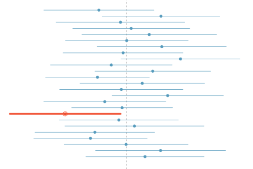

class: center, middle, title-slide

.upper-right[
```{r logo, eval = TRUE, echo = FALSE, out.width = "605px"}
knitr::include_graphics("../../img/cds-101-online-logo.png")
```
]

.lower-right[
```{r cc-by-sa, eval = TRUE, echo = FALSE, out.width = "88px"}
knitr::include_graphics("../../img/cc-by-nc-sa.png")
```

These slides are licensed under a [Creative Commons Attribution-NonCommercial-ShareAlike 4.0 International License](http://creativecommons.org/licenses/by-nc-sa/4.0/).
]

# .font90[Inference and simulation]
.title-hline[
## Simulating the confidence interval
]

```{r setup, include = FALSE}
# DO NOT ALTER THIS CHUNK
source("../../R/xaringan_setup.R")
# Load required packages
library(ggplot2)
library(dplyr)
library(readr)
library(infer)
# Set seed
set.seed(702083)
# Gender discrimination dataset
applicants_data <- read_rds("../../data/gender_discrimination.rds")
```

---

# .font90[Example: Constructing a confidence interval]

.qa[
How do we construct a 95% confidence interval for the gender discrimination experiment?
]

--

We can use the bootstrap simulation from .mono[infer]:

---

layout: true

# .font90[Example: Constructing a confidence interval]

.qa[
How do we construct a 95% confidence interval for the gender discrimination experiment?
]

We can use the bootstrap simulation from .mono[infer]:

---

count: false

1. Copy over code used to generate the null distribution.

<span style="opacity: 0;">Change the assigned variable name.</span>

<span style="opacity: 0;">Remove the .mono[hypothesize()] line.</span>

<span style="opacity: 0;">Change the type keyword to .mono["bootstrap"] in `generate()`.</span>

```r
*simulation_results <- applicants_data %>%
  specify(outcome ~ sex, success = "Promoted") %>%
* hypothesize(null = "independence") %>%
* generate(reps = 10000, type = "permute") %>%
  calculate(stat = "diff in props", order = combine("Male", "Female"))
```

---

1. Copy over code used to generate the null distribution.

2. Change the assigned variable name.

<span style="opacity: 0;">Remove the .mono[hypothesize()] line.</span>

<span style="opacity: 0;">Change the type keyword to .mono["bootstrap"] in .mono[generate()].</span>

```r
simulation_bootstrap <- applicants_data %>%
  specify(outcome ~ sex, success = "Promoted") %>%
* hypothesize(null = "independence") %>%
* generate(reps = 10000, type = "permute") %>%
  calculate(stat = "diff in props", order = combine("Male", "Female"))
```

---

1. Copy over code used to generate the null distribution.

2. Change the assigned variable name.

3. Remove the .mono[hypothesize()] line.

<span style="opacity: 0;">Change the type keyword to .mono["bootstrap"] in .mono[generate()].</span>

```r
simulation_bootstrap <- applicants_data %>%
  specify(outcome ~ sex, success = "Promoted") %>%
* generate(reps = 10000, type = "permute") %>%
  calculate(stat = "diff in props", order = combine("Male", "Female"))
```

---

1. Copy over code used to generate the null distribution.

2. Change the assigned variable name.

3. Remove the .mono[hypothesize()] line.

4. Change the type keyword to .mono["bootstrap"] in .mono[generate()].

```{r gender-discrimination-bootstrap}
simulation_bootstrap <- applicants_data %>%
  specify(outcome ~ sex, success = "Promoted") %>%
  generate(reps = 10000, type = "bootstrap") %>%
  calculate(stat = "diff in props", order = combine("Male", "Female"))
```

---

layout: false

# .font90[Example: Constructing a confidence interval]

.qa[
How do we construct a 95% confidence interval for the gender discrimination experiment?
]

.font90[After running the bootstrap simulation, we can obtain the 95% confidence interval using .mono[get_confidence_interval()],]

.code80[
```{r gender-discrimination-ci}
simulation_ci <- simulation_bootstrap %>%
  get_confidence_interval()
```
]

--

<div style="margin-bottom: 3%;"></div>

.font90[
```{r gender-discrimination-ci-bounds-table, echo = FALSE}
simulation_ci %>%
  knitr::kable(format = "html")
```
]

--

.font90[To visualize the confidence interval, we use the .mono[visualize()] and .mono[shade_confidence_interval] functions,]

.code80[
```r
simulation_bootstrap %>%
  visualize() +
  shade_confidence_interval(simulation_ci)
```
]

---

# .font90[Example: Constructing a confidence interval]

<div style="margin-bottom: 5%;"></div>

```{r gender-discrimination-ci-visualization, echo = FALSE, out.width = "90%"}
ci_lower <- pull(simulation_ci, lower_ci)
ci_upper <- pull(simulation_ci, upper_ci)
simulation_bootstrap %>%
  visualize() +
  shade_confidence_interval(simulation_ci) +
  labs(
    x = "difference in fraction of male and female promotions",
    y = "frequency",
    title = "Bootstrap distribution: diff in props",
    subtitle = paste0(
      "confidence interval (",
      round(ci_lower, 4), ", ",
      round(ci_upper, 4), ")"
    )
  )
```

--

**Interpretation:** All else kept equal, men are, on average, between `r round(100 * ci_lower, 1)`% to `r round(100 * ci_upper, 1)`% more likely to be promoted than women.

---

# What does 95% confident mean?

<div style="margin-bottom: 5%;"></div>

* Suppose we generated a series of bootstrap distributions with .mono[infer] and found the 95% confidence interval for each one

--

* Let's also assume that, for one reason or another, we somehow knew the value of the true population mean

--

* Then, the phrase "95% confident" means that about 95% of those intervals would contain the true population mean

--

.pull-left[
* The figure shows this process with 25 samples, where 24 of the resulting confidence intervals contain the true average number of exclusive relationships, and one does not.
]

.pull-right[
```{r confidence-interval-visual, echo = FALSE, out.width = "95%"}

```
]

---

# Width of an interval

.qa[
If we want to be more certain that we capture the population parameter, i.e. increase our confidence level, should we use a wider interval or a smaller interval?
]

--

.answer[A wider interval.]

--

.qa[
Can you see any drawbacks to using a wider interval?
]

--

.footnote[
Image source (defunct): <http://web.as.uky.edu/statistics/users/earo227/misc/garfield_weather.gif>
]

```{r garfield-comic, echo = FALSE, out.width = "70%"}
knitr::include_graphics("../../img/garfield.png")
```

.answer[If the interval is too wide it may not be very informative.]

--

Commonly used confidence levels in practice are 90%, 95%, 98%, and 99%.

---

# Credits

.left-column[
License

Acknowledgments
]

.right-column[
.font80[[Creative Commons Attribution-NonCommerical-ShareAlike 4.0 International](https://creativecommons.org/licenses/by-nc-sa/4.0/)]

Content adapted from the Chapter 4 [OpenIntro Statistics slides](https://github.com/OpenIntroOrg/openintro-statistics-slides) developed by Mine Çetinkaya-Rundel and made available under the [CC BY-SA 3.0 license](http://creativecommons.org/licenses/by-sa/3.0/us/).
]
