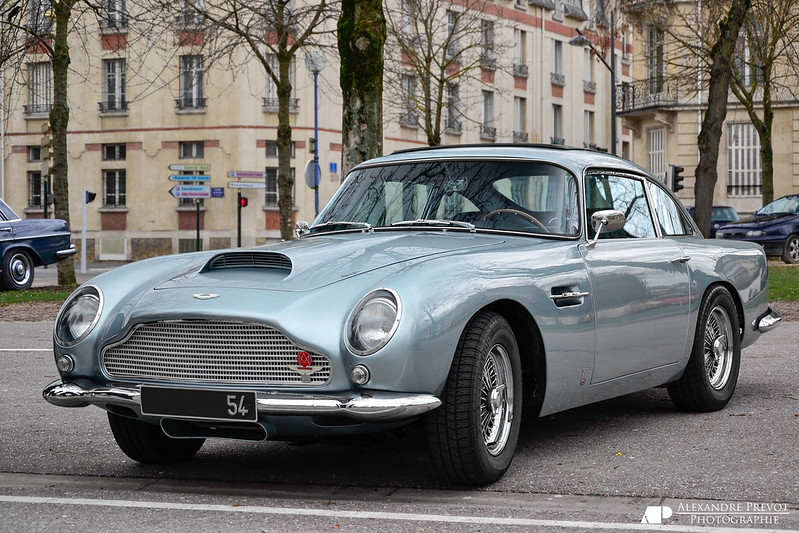
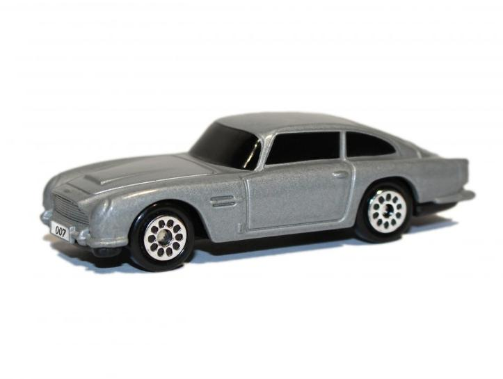

class: center, middle, title-slide

.upper-right[
```{r logo, echo = FALSE, out.width = "605px"}
knitr::include_graphics("../../img/cds-101-online-logo.png")
```
]

.lower-right[
```{r cc-by-sa, echo = FALSE, out.width = "88px"}
knitr::include_graphics("../../img/cc-by-nc-sa.png")
```

These slides are licensed under a [Creative Commons Attribution-NonCommercial-ShareAlike 4.0 International License](http://creativecommons.org/licenses/by-nc-sa/4.0/).
]

# .font90[Modeling]
.title-hline[
## What is a model and how do you build one?
]

```{r setup, include = FALSE}
# DO NOT ALTER THIS CHUNK
source("../../R/xaringan_setup.R")
library(tidyverse)
library(modelr)
library(broom)
```

---


# What do we mean by "modeling"?

.answer.center[A model is a simplified representation of reality.]

--

.pull-left[]

--

.pull-right[]

<!-- -- -->

<!-- * Architectural plans are *models* of houses. -->

---

# Why do we need mathematical models?

* Models allow us to simplify observed data about the world into just a few parameters.

* For example, we might fit a straight line through some points:

<!-- Although this doesn't represent all the variation in the data, it simplifies a large dataset down to just two numbers: the slope of the line and the intercept. -->

```{r, echo=FALSE, fig.height=4}
ggplot(sim1, aes(x, y)) + 
  geom_jitter() +
  geom_smooth(method="lm", se=FALSE)
```

* Models can be used to measure the relationship between variables, or to make predictions.

---

# The limitations of models

.qa[*All models are wrong but some are useful.* - George Box]

* Poorly constructed models can misrepresent real relationships.

* Correlation does not imply causation.

---

# Credits

.left-column[
License
]

.right-column[
.font80[[Creative Commons Attribution-NonCommerical-ShareAlike 4.0 International](https://creativecommons.org/licenses/by-nc-sa/4.0/)]
]
