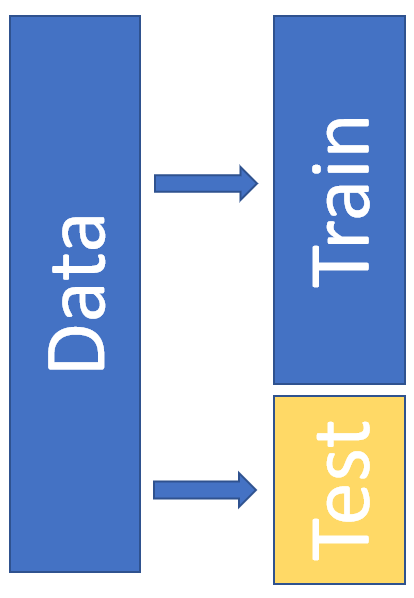
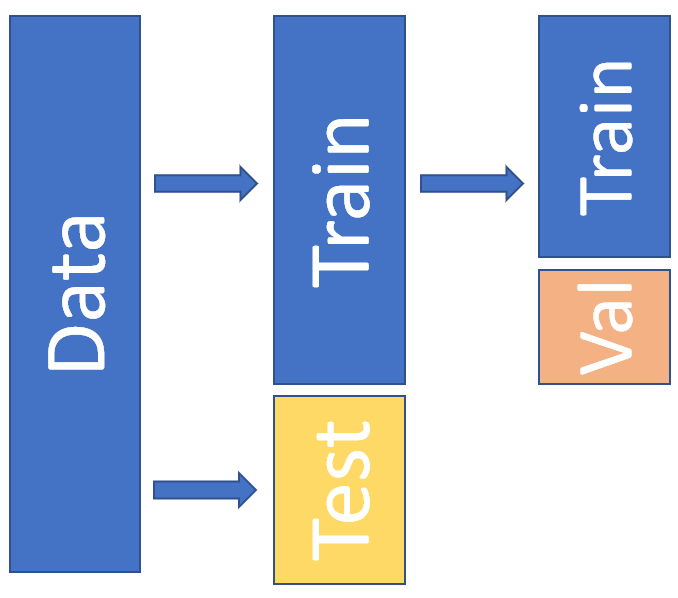

class: center, middle, title-slide

.upper-right[
```{r logo, echo = FALSE, out.width = "605px"}
knitr::include_graphics("../../img/cds-101-logo-slides-no-icon.png")
```
]

.lower-right[
```{r cc-by-sa, echo = FALSE, out.width = "88px"}
knitr::include_graphics("../../img/cc-by-nc-sa.png")
```

These slides are licensed under a [Creative Commons Attribution-NonCommercial-ShareAlike 4.0 International License](http://creativecommons.org/licenses/by-nc-sa/4.0/).
]

# .font90[Prediction]
.title-hline[
## Data splits
]

```{r setup, include = FALSE}
# DO NOT ALTER THIS CHUNK
source("../../R/xaringan_setup.R")
library(tidyverse)
library(modelr)
library(broom)
```

---

# Assessing predictive models

We measure how good a predictive model is by how accurately it can predict data.

* Models should be able to predict the data they were trained on more accurately than new data.

* We typically want to use the model to make predictions on new data.

* There are different ways of measuring how good a model is at making predictions: these are called **error metrics**

  * Accuracy is an error metric that measures at the percentage of correct predictions.

* We care about the *generalization error*: how good are our predictions on unseen data?

We cannot measure error on the same data that the model was trained on... but we also don't know what future data will be.

---

# Training set vs. test set

> **Solution:** split our dataset into a portion for training the model and a portion for evaluating its accuracy.

.pull-left[
```{r, echo = FALSE}

```
]

.pull-right[
These are called the training set and test set.
]

---

# Cross-validation

If we make small adjustments to our model, and then re-evaluate its accuracy on the test set we have a problem...

--

We are again optimizing our model for the test set, and so our prediction accuracy will also be better than on completely unseen data.

--

.pull-left[
We need to fine tune our model on another subset of the data. 

We further subdivide the training set into a validation set and a smaller training set.
]

.pull-right[
```{r, echo = FALSE, out.width = "300px"}

```
]


---

# K-fold Cross-validation

The trouble with dividing our data up is that we are getting less and less of it! But... models become more accurate with more data.

--

**K-fold Cross-validation**: Divide training set into *k* parts and validate on each.

An example with $k=5$:

* Set aside one of the 5 parts as the validation dataset.

* Train model on remaining 4 parts.

* Evaluate on the validation set.

Repeat until each of the 5 parts has been the validation set for the other 80% of the data.

Take the average of the generalization error on each of the 5 validation sets as the overall cross-validation error.


---

# K-fold Cross-validation

The trouble with dividing our data up is that we are getting less and less of it! But... models become more accurate with more data.

**K-fold Cross-validation**: Divide training set into *k* parts and validate on each.

```{r, echo = FALSE}
knitr::include_graphics("../../img/Train-Test-Validation-kfold.png")
```

---

# Machine learning workflow overview

1. Divide data into training and test sets.

2. Explore dataset using visualization and summary statistics.

3. Pick a type of model, e.g. linear regression, and preprocess the training data into an appropriate format for the algorithm.

4.  i. Train the model using cross-validation to measure its error.
  
    ii. Repeat step (i) with different settings, until you find the best combination of settings.

5. Take this best model and measure its final generalization error on the test set.

6. Return to an earlier step and try to your generalization error at step 5.

7. Do something cool with your model!

---

# Credits

.left-column[
License
]

.right-column[
.font80[[Creative Commons Attribution-NonCommerical-ShareAlike 4.0 International](https://creativecommons.org/licenses/by-nc-sa/4.0/)]

Test-train-validation split figure adapted from [Wikimedia](https://commons.wikimedia.org/wiki/File:Train-Test-Validation.png) and reused under a [CC BY-NC-SA 4.0](https://creativecommons.org/licenses/by-nc-sa/4.0/) license.
]
