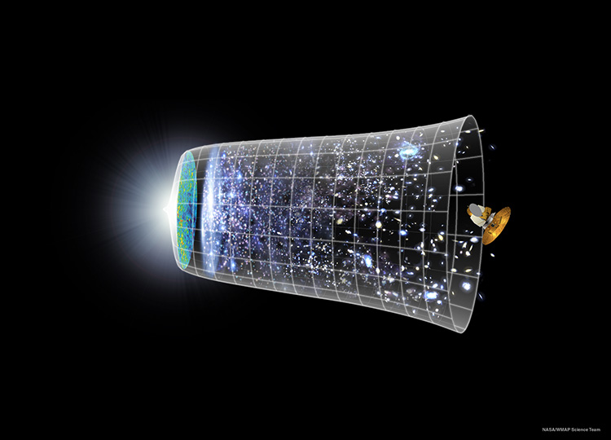
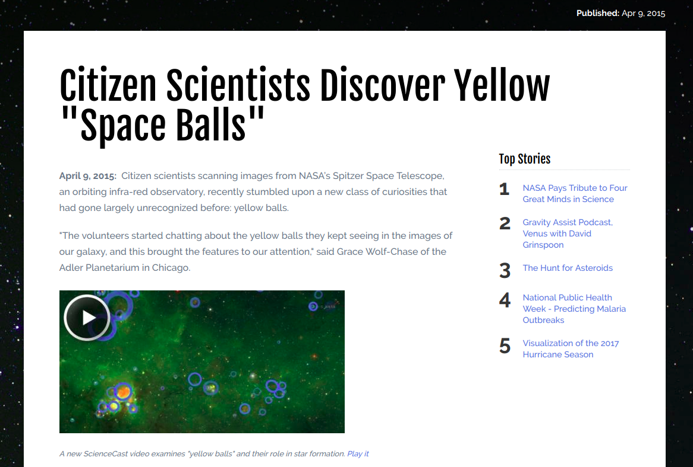
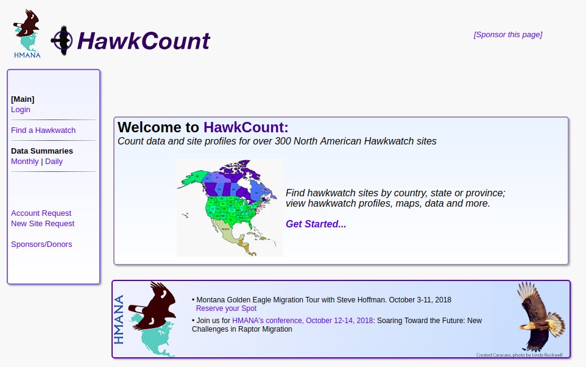

class: center, middle, title-slide

.upper-right[
```{r logo, eval = TRUE, echo = FALSE, out.width = "605px"}
knitr::include_graphics("../../img/cds-101-online-logo.png")
```
]

.lower-right[
```{r cc-by-sa, eval = TRUE, echo = FALSE, out.width = "88px"}
knitr::include_graphics("../../img/cc-by-nc-sa.png")
```

These slides are licensed under a [Creative Commons Attribution-ShareAlike 4.0 International License](http://creativecommons.org/licenses/by-sa/4.0/).
]

# .font90[What are the computational and data sciences?]
.title-hline[
## Science
]

```{r setup, include = FALSE}
# DO NOT ALTER THIS CHUNK
source("../../R/xaringan_setup.R")
```

---

# What is science?

--

<div style="display:float;position:fixed;top:23%;left:10%">
(1) A set of facts
</div>

```{r pile-of-documents, echo = FALSE, out.width="20%", out.extra='style="display:float;position:fixed;top:15%;right:10%"'}

```

--

<div style="display:float;position:fixed;top:45%;left:10%">
(2) Something that professional scientists do
</div>

```{r scientist-icon, echo = FALSE, out.width="15%", out.extra='style="display:float;position:fixed;top:35%;right:12%"'}

```

--

<div style="display:float;position:fixed;top:72%;left:10%">
(3) The underlying Truth about the Universe
</div>

```{r nasa-universe-timeline, echo = FALSE, out.width="30%", out.extra='style="display:float;position:fixed;top:60%;right:5%"'}

```

.footnote[Credit: NASA / WMAP Science Team]

---

# What is science?

<h2 style="margin-top:12%;">A set of facts</h2>

```{r pile-of-documents, echo = FALSE, out.width="20%", out.extra='style="display:float;position:fixed;top:15%;right:5%"'}
```

--

* We are constantly making new discoveries and collecting new data

--

* Technology and experiments are changing

--

* Old Theories are replaced by new Theories

--

* Scientific "Facts"

---

# What is science?

<h2 style="margin-top:12%;font-size:32px;">Something that professional scientists do</h2>

```{r scientist-icon, echo = FALSE, out.width="15%", out.extra='style="display:float;position:fixed;top:15%;right:5%"'}
```

--

* What is a scientist?

--

* Do you need a PhD?

--

* There are countless examples of amateur scientists playing a role in discovery

--

* Being scientific **does not** require becoming a member of a professional society

---

# What is science?

```{r nasa-spaceballs-discovery, echo = FALSE, out.width = "88%"}

```

.footnote[
Molina, Rachel. "15 Citizen Scientists Discover Yellow 'Space Balls.'" *NASA Science*, 9 Apr. 2015, https://science.nasa.gov/science-news/science-at-nasa/2015/09apr_yellowballs.
]

---

# What is science?

```{r hawk-count-data, echo = FALSE, out.width = "88%"}

```

.footnote[Source: http://hawkcount.org]

---

# What is science?

<h2 style="margin-top:12%;font-size:30px;">The underlying Truth about the Universe</h2>

```{r nasa-universe-timeline, echo = FALSE, out.width="27%", out.extra='style="display:float;position:fixed;top:15%;right:3%"'}
```

.footnote[Credit: NASA / WMAP Science Team]

--

* Science is a process, not dogma

--

* Science experiments are able to falsify hypotheses, but they cannot prove that a claim is the *Truth*

--

* The predictive tools of science, models and simulations, are used to *represent* the world to the best of our current knowledge

---

<h1 style="margin-bottom:15%;">What is science?</h1>

--

* **Science**

  a study that uses the scientific method

--

* **Natural science**
  
  .quote-container[
  > The branch of science concerned with the description, prediction, and understanding of natural phenomena, based on empirical evidence from observation and experimentation. Mechanisms such as peer review and repeatability of findings are used to try to ensure the validity of scientific advances.
  > .cite[Wikipedia]
  ]

---

<h1 style="margin-bottom:1.125em;">The scientific method</h1>

--

1. Review evidence

--

2. Hypothesis

--

3. Formulate predictive test

--

4. Design/run experiment

--

5. Validate or revise hypothesis

---

# The scientific method

.pull-left[
1. Review evidence

2. Hypothesis

3. Formulate predictive test

4. Design/run experiment

5. Validate or revise hypothesis
]

.pull-right[
In practice, research programs don't strictly adhere to this step order. It's a list of principles, not a recipe.
]

--

.answer.center[**Key point:** create a hypothesis and collect evidence to test it out]

--

* Empirical observations constitute evidence.

--

* A hypothesis is compared with the outcomes of the natural world ("Nature"), not voted on by an individual or a committee

--

* A hypothesis should be testable by anyone, regardless of time, place, culture, etc. Anyone can double check an experiment!

---

# Credits

.left-column[
License

Acknowledgments
]

.right-column[
.font80[[Creative Commons Attribution-NonCommerical-ShareAlike 4.0 International](https://creativecommons.org/licenses/by-nc-sa/4.0/)]

Content adapted from the [Lecture 1: The Computational and Data Sciences slides](http://bobweigel.net/cds101/index.php?title=lecture1) by John Wallin.
]
