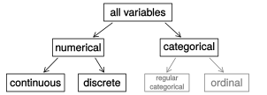

class: center, middle, title-slide

.upper-right[
```{r logo, eval = TRUE, echo = FALSE, out.width = "605px"}
knitr::include_graphics("../../img/cds-101-online-logo.png")
```
]

.lower-right[
```{r cc-by-sa, eval = TRUE, echo = FALSE, out.width = "88px"}
knitr::include_graphics("../../img/cc-by-sa.png")
```

These slides are licensed under a [Creative Commons Attribution-ShareAlike 4.0 International License](http://creativecommons.org/licenses/by-sa/4.0/).
]

# .font90[What are the computational and data sciences?]
.title-hline[
## Data overview
]

```{r setup, include = FALSE}
# DO NOT ALTER THIS CHUNK
source("../../R/xaringan_setup.R")
```

---

# Definitions

## Variable

A quantity, quality, or property that you can measure.

--

## Value

The state of a variable when you measure it.
The value of a variable may change from measurement to measurement.

--

## Observation

A set of measurements made under similar conditions (you usually make all of the measurements in an observation at the same time and on the same object).
An observation contains several values, each associated with a different variable.

---

# Definitions

## Explanatory and response variables

<div style="margin-bottom:10%">
To identify the explanatory variable in a pair of variables, identify which of the two is suspected of affecting the other
</div>

--

```{r explanatory-might-affect-response, echo = FALSE, out.width = "60%"}

```

--

<div style="margin-top:10%">
Labeling variables as explanatory and response does not guarantee the relationship between the two is actually causal, even if there is an association identified between the two variables. We use these labels only to keep track of which variable we suspect affects the other.
</div>

---

count: false

# Definitions

## Tabular data (rectangular data)

<div style="margin-bottom:5%;">
A set of values, each associated with a variable and an observation.
</div>

--


| Stu.     | sex      | sleep    | $\cdots$ | dread    |
| -------- | -------- | -------- | -------- | -------- |
| 1        | male     | 5        | $\cdots$ | 3        |
| 2        | female   | 7        | $\cdots$ | 2        |
| 3        | female   | 5.5      | $\cdots$ | 4        |
| 4        | female   | 7        | $\cdots$ | 2        |
| $\vdots$ | $\vdots$ | $\vdots$ | $\vdots$ | $\vdots$ |
| 21       | male     | 6        | $\cdots$ | 3        |

.font90.center[*Data collected on students in a data science class on a variety of variables*]

---

# Kinds of data

## Numerical

Data that is a number, either an *integer* (whole numbers) or a *float* (real numbers).
This kind of data is collected from device sensors, through counting and polling, outputs of computational simulations, etc.

--

## Categorical

Groups observations into a set.
Categories can be in text form (*strings* or *characters*), for example brand names for a certain kind of product, or numerical, for example labeling city districts by numbers.

--

## Textual

Plain text that is too varied to be treated as a category.
Some examples can be full names, the text of a literary work, tweets, etc.

---

# Kinds of data

.vhalign-slide[
```{r types-of-variables, echo = FALSE, out.width = "100%"}

```
]

---

# Example: types of variables

| Stu. | sex    | sleep | bedtime | countries | dread |
| ---- | ------ | ----- | ------- | --------- | ----- |
| 1    | male   | 5     | 12 – 2  | 13        | 3     |
| 2    | female | 7     | 10 – 12 | 7         | 2     |
| 3    | female | 5.5   | 12 – 2  | 1         | 4     |
| 4    | female | 7     | 12 – 2  |           | 2     |
| 5    | female | 3     | 12 – 2  | 1         | 3     |
| 6    | female | 3     | 12 – 2  | 9         | 4     |

--

*   *sex:* categorical
--

*   *sleep:* numerical, continuous
--

*   *bedtime:* categorical, ordinal
--

*   *countries:* numerical, discrete
--

*   *dread:* categorical, ordinal (or numerical)

---

<h1 style="margin-bottom:12.5%">Modes of data collection</h1>

There are two main modes of data collection that affect the strength of a researcher's conclusions.

--

* **Observational/field study**: Researchers collect data in a way that does not directly interfere with how the data arise, i.e. they merely "observe".

--

* **Experiment**: Researchers systematically control variables in order to establish causal connections

--

  * Careful tuning of one parameter of an experimental appartus, changing a single chemical component, altering one nutrient in an organism's diet, etc.
  
--
  
  * Blind studies: randomly assign subjects to treatments. Becomes double blind if experimental observers are also randomly assigned.

---

# How do we obtain data?

## Manual measurements

* Compared to a baseline: ruler, scale, stopwatch
  
* Record-keeping: counting, behaviorial notes, ledgers, timelines, relationships
  
* Self-reporting: surveys and interviews

--

## Sensor measurements

* Electrical, temperature, mechanical, chemical, electromagnetic, navigation, cameras/light, pressure, etc.
  
* A lot of these are in a cell phone!
  
* Benefits: automation, precision, access to properties that manual methods cannot measure

---

# How do we obtain data?

## Digital artifacts

* Internet: server logs, social network activity, web search, online transactions, data transmissions, etc.
  
* Digital text corpus: digital books, articles, government documents, email, messaging, etc.
  
* Databases: scientific, social, government, business, etc.

---

# Credits

.left-column[
License

Acknowledgments
]

.right-column[
[Creative Commons Attribution-ShareAlike 4.0 International](https://creativecommons.org/licenses/by-sa/4.0/)

Content adapted from:
* The chapter 1 [OpenIntro Statistics slides](https://github.com/OpenIntroOrg/openintro-statistics-slides) developed by Mine Çetinkaya-Rundel and made available under the [CC BY-SA 3.0 license](http://creativecommons.org/licenses/by-sa/3.0/us/)
* Chapter 2 from *Modern Data Science with R* by Benjamin Baumer, Daniel Kaplan, and Nicholas Horton
* The [Lecture 7 - Sensors and Scientific Measurements](http://bobweigel.net/cds101/index.php?title=lecture7) by John Wallin
]
