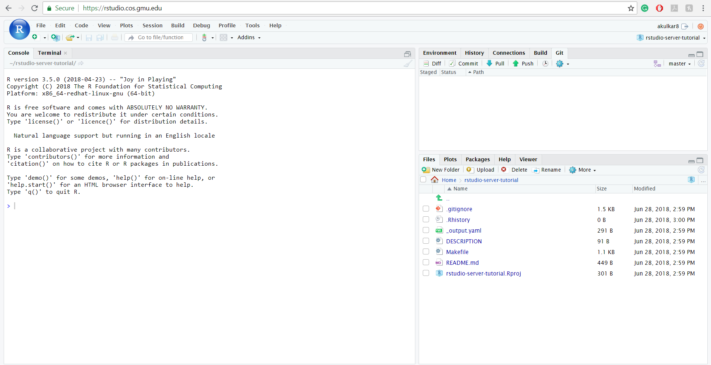

class: center, middle, title-slide

.upper-right[
```{r logo, eval = TRUE, echo = FALSE, out.width = "605px"}
knitr::include_graphics("../../img/cds-101-online-logo.png")
```
]

.lower-right[
```{r cc-by-sa, eval = TRUE, echo = FALSE, out.width = "88px"}
knitr::include_graphics("../../img/cc-by-nc-sa.png")
```

These slides are licensed under a [Creative Commons Attribution-NonCommercial-ShareAlike 4.0 International License](http://creativecommons.org/licenses/by-nc-sa/4.0/).
]

# .font90[What are the computational and data sciences?]
.title-hline[
## Reproducibility
]

```{r setup, include = FALSE}
# DO NOT ALTER THIS CHUNK
source("../../R/xaringan_setup.R")
library(ggplot2)
```

---

<h1 style="margin-bottom: 7%">Science and reproducibility</h1>

<div style="margin-bottom: 5%">Recall the key point from our review of the scientific method:</div>

.answer.center[
**Key point:** create a hypothesis and collect evidence to test it out
]

<div style="margin-bottom: 5%"></div>

--

* Empirical observations constitute evidence.

* A hypothesis should be testable by anyone, regardless of time, place, culture, etc. Anyone can double check an experiment!

--

<div style="margin-bottom: 6%"></div>

.qa.center[
How often do scientists actually do this?
]

---

# Survey says...

.footnote[
Source: M. Baker, "1,500 scientists lift the lid on reproducibility," Nature **533**, 452 (2016)
]

.valign-slide[
```{r reproducibility-graphic-6, echo = FALSE}
knitr::include_graphics("../../img/reproducibility-graphic-online6.jpg")
```
]

---

<h1 style="margin-bottom: 12%">Reproducibility in practice</h1>

The scientific ideal of reproducibility is sometimes easier said than done, and there many reasons why this is the case:

* Lack of funding sources

* Lack of data sharing

* Lack of interest

* "Top-tier" journals won't publish

* Vague methods

* And more...

---

<h1 style="margin-bottom: 7%">Replicating results: the reality</h1>

.pull-left[
```{r reproducibility-graphic-3a, echo = FALSE, out.width = "100%"}

```
]

.pull-right[
```{r reproducibility-graphic-3b, echo = FALSE, out.width = "100%", out.extra = "style='margin-top: 8%'"}

```
]

.footnote[
Source: M. Baker, "1,500 scientists lift the lid on reproducibility," Nature **533**, 452 (2016)
]

---

# The Reproducibility Project

```{r reproducibility-project-paper, echo = FALSE, out.width = "80%"}

```

.quote-container[
> Brian Nosek of University of Virginia and colleagues sought out to replicate 100 different studies that all were published in 2008. The project pulled these studies from three different [psychology] journals... to see if they could get the same results as the initial findings. [...] Only 36.1% of the studies [were] replicated.
.cite[[Reproducibility Project](https://en.wikipedia.org/wiki/Reproducibility_Project) Wikipedia entry]
]

---

layout: true

# .font60[Is the evidence for austerity based on an Excel spreadsheet error?]

.footnote[
Sources: https://www.washingtonpost.com/news/wonk/wp/2013/04/16/is-the-best-evidence-for-austerity-based-on-an-excel-spreadsheet-error/, http://www.bbc.com/news/magazine-22223190, https://www.peri.umass.edu/publication/item/526-does-high-public-debt-consistently-stifle-economic-growth-a-critique-of-reinhart-and-rogo-ff
]

---

<div style="margin-top: 15%;"></div>

* C. Reinhart and K. Rogoff, "Growth in a Time of Debt", Amer. Econ. Rev. **100**, 573-578 (2010)

* Influential economics paper that found that when a country's GDP to debt ratio reaches 90%, GDP growth is cut almost in half.

* Cited as evidence for implementing austerity measures post-2008 financial crisis

* Dataset and analysis were not made public at time of publication

---

<div style="margin-top: 8%;"></div>

A graduate student at U. Mass. Amherst, Thomas Herndon, tried to replicate the study's results using publicly available country spreadsheet data as homework for one of his classes...
--
...and could not.

--

In 2013, Herndon wrote to Reinhart and Rogoff asking for their dataset, and they obliged.

--

After receiving the data and analysis, Herndon, working with two of his professors, published a critique based on the following:

1. The accidental exclusion of available data and data gaps

2. A spreadsheet coding error

3. Unconventional weighting of summary statistics

---

layout: false

# Meet the toolkit

---

.answer.center[**Primary tool:** R]

```{r r-logo, echo = FALSE, out.width = "20%"}
knitr::include_graphics("../../img/r-logo.png")
```

.pull-left[
.code70[
```r
side_one <- 3
side_two <- 4
hypotenuse <- sqrt(side_one^2 + side_two^2)
result <- paste(
  "A triangle with sides of length",
  side_one,
  "and length",
  side_two,
  "has a hypotenuse of length",
  hypotenuse
)

print(result)
```
]
]

.pull-right[
```{r sample-r-snippet, echo = FALSE, results = "markup"}
side_one <- 3
side_two <- 4
hypotenuse <- sqrt(side_one^2 + side_two^2)
result <- paste0(
  "[1] A triangle with sides of",
  "\n",
  "length ",
  side_one,
  " and length ",
  side_two,
  " has a",
  "\n",
  "hypotenuse of length ",
  hypotenuse
)

cat(result)
```
]

---

.answer.center[**Utility belt:** tidyverse packages]

```{r tidyverse-logo, echo = FALSE, out.width = "100%", out.extra="style='margin-top: 7%'"}
knitr::include_graphics("../../img/tidyverse-logo.png")
```

---

.answer.center[**Workshop:** RStudio Server]

```{r rstudio-logo, echo = FALSE, out.width = "20%"}
knitr::include_graphics("../../img/rstudio-logo.png")
```

```{r rstudio-server-screenshot, echo = FALSE, out.width = "100%"}

```

---

.answer.center[**Storage room:** GitHub]

```{r github-logo, echo = FALSE, out.width = "25%"}

```

```{r github-screenshot, echo = FALSE, out.width = "100%"}

```

---

layout: false

# R Markdown

```{r hello-r-markdown, echo = FALSE, out.width = "85%"}
knitr::include_graphics("../../img/hello-r-markdown.png")
```

.font80[
* Fully reproducible reports – each time you knit the analysis is ran from the beginning

* Simple markdown syntax for text

* Code goes in chunks, defined by three back-ticks, narrative goes outside of chunks
]

---

layout: false

# Credits

.left-column[
License

Acknowledgments
]

.right-column[
.font80[[Creative Commons Attribution-NonCommerical-ShareAlike 4.0 International](https://creativecommons.org/licenses/by-nc-sa/4.0/)]

Slides originally developed by James Glasbrenner.
]
