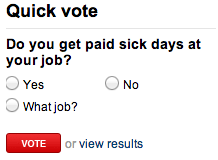

class: center, middle, title-slide

.upper-right[
```{r logo, eval = TRUE, echo = FALSE, out.width = "605px"}
knitr::include_graphics("../../img/cds-101-online-logo.png")
```
]

.lower-right[
```{r cc-by-sa, eval = TRUE, echo = FALSE, out.width = "88px"}
knitr::include_graphics("../../img/cc-by-sa.png")
```

These slides are licensed under a [Creative Commons Attribution-ShareAlike 4.0 International License](http://creativecommons.org/licenses/by-sa/4.0/).
]

# .font90[What are the computational and data sciences?]
.title-hline[
## Data sampling
]

```{r setup, include = FALSE}
# DO NOT ALTER THIS CHUNK
source("../../R/xaringan_setup.R")
```

---

# Populations and samples

**Research question**: Can people become better, more efficient runners on their own, merely by running?

```{r running-figure, out.width = "45%", fig.align = "center", echo = FALSE}
knitr::include_graphics("../../img/running.png")
```

<span style="font-size: 0.7em;">Source: <http://well.blogs.nytimes.com/2012/08/29/finding-your-ideal-running-form></span>

---

count: false

# Populations and samples

```{r running-figure2, out.width = "40%", fig.align = "center", echo = FALSE}
knitr::include_graphics("../../img/running.png")
```

**Research question**: Can people become better, more efficient runners on their own, merely by running?
--

.qa[Question: What is the population of interest?]
--

.answer[Answer: All people]

--

**Study Sample**: Group of adult women who recently joined a running group
--

.qa[Question: Population to which results can be generalized?]
--

.answer[Answer: Adult women, if the data are randomly sampled]

---

# .font80[Anecdotal evidence and early smoking research]

*   Anti-smoking research started in the 1930s and 1940s when cigarette smoking became increasingly popular. While some smokers seemed to be sensitive to cigarette smoke, others were completely unaffected.

.footnote[Source: Brandt, *The Cigarette Century* (2009), Basic Books.]

--

*   Anti-smoking research was faced with resistance based on **anecdotal evidence** such as "My uncle smokes three packs a day and he's in perfectly good health", evidence based on a limited sample size that might not be representative of the population.

--

*   It was concluded that "smoking is a complex human behavior, by its nature difficult to study, confounded by human variability."

--

*   In time researchers were able to examine larger samples of cases (smokers), and trends showing that smoking has negative health impacts became much clearer.

---

# Sampling from a population: Census

.footnote[Source: http://www.npr.org/templates/story/story.php?storyId=125380052]

*   Wouldn't it be better to just include everyone and "sample" the entire population? 

--

*   This is called a **census**.

--

*   There are problems with taking a census:

--

*   *It can be difficult to complete a census:* there always seem to be some individuals who are hard to locate or hard to measure. **And these difficult-to-find people may have certain characteristics that distinguish them from the rest of the population.**

--

*   Populations rarely stand still. Even if you could take a census, the population changes constantly, so it's never possible to get a perfect measure.

--

*   Taking a census may be more complex than sampling.

---

# Exploratory analysis to inference

*   Sampling is natural

--

*   Think about sampling something you are cooking - you taste (examine) a small part of what you're cooking to get an idea about the dish as a whole.

--

*   When you taste a spoonful of soup and decide the spoonful you tasted isn't salty enough, that's **exploratory analysis**.

--

*   If you generalize and conclude that your entire soup needs salt, that's an **inference**.

--

*   For your inference to be valid, the spoonful you tasted (the sample) needs to be **representative** of the entire pot (the population).

--

*   If your spoonful comes only from the surface and the salt is collected at the bottom of the pot, what you tasted is probably not representative of the whole pot.

--

*   If you first stir the soup thoroughly before you taste, your spoonful will more likely be representative of the whole pot.

---

# Sampling bias

*   **Non-response**: If only a small fraction of the randomly sampled people choose to respond to a survey, the sample may no longer be representative of the population.

*   **Voluntary response**: Occurs when the sample consists of people who volunteer to respond because they have strong opinions on the issue. Such a sample will also not be representative of the population.

--

.pull-left[
```{r responses-figures-1, out.width = "50%", echo = FALSE}

```
]

.pull-right[
```{r responses-figures-2, out.width = "50%", echo = FALSE}

```
]

.footnote[
Source: cnn.com, Jan 14, 2012
]

--

*   **Convenience sample**: Individuals who are easily accessible are more likely to be included in the sample.

---

# Sampling bias example: Landon vs. FDR

A historical example of a biased sample yielding misleading results:

--

.pull-left[
```{r landon-figure-1, out.width = "50%", echo = FALSE}
knitr::include_graphics("../../img/landon.png")
```
]

.pull-right[
```{r landon-figure-2, out.width = "50%", echo = FALSE}

```
]

In 1936, Landon sought the Republican presidential nomination opposing the re-election of FDR.

---

# The Literary Digest Poll

*   The Literary Digest polled about 10 million Americans, and got responses from about 2.4 million.

--

*   The poll showed that Landon would likely be the overwhelming winner and FDR would get only 43% of the votes.

--

*   Election result:  FDR won, with 62% of the votes.

--

```{r literary-digest-figure, out.width = "20%", echo = FALSE}

```

*   The magazine was completely discredited because of the poll, and was soon discontinued.

---

# .font90[The Literary Digest Poll - what went wrong?]

The magazine had surveyed:

--

* Its own readers

--

* Registered automobile owners

--

* Registered telephone users

--

These groups had incomes well above the national average of the day (remember, this is Great Depression era) which resulted in lists of voters far more likely to support Republicans than a truly **typical** voter of the time, i.e. the sample was not representative of the American population at the time.

---

<h1 style="margin-bottom:20%">Large samples are preferable, but...</h1>

*   The Literary Digest election poll was based on a sample size of 2.4 million, which is huge, but since the sample was **biased**, the sample did not yield an accurate prediction.

--

*   Back to the soup analogy: If the soup is not well stirred, it doesn't matter how large a spoon you have, it will still not taste right. If the soup is well stirred, a small spoon will suffice to test the soup.

---

# Correlation does not imply causation

.vhalign-slide[
```{r xkcd-figure, out.width = "100%", echo = FALSE}
knitr::include_graphics("../../img/xkcd_correlation.png")
```
]

.footnote[
Source: http://xkcd.com/552/
]

---

# Credits

.left-column[
License

Acknowledgments
]

.right-column[
[Creative Commons Attribution-ShareAlike 4.0 International](https://creativecommons.org/licenses/by-sa/4.0/)

Content adapted from the chapter 1 [OpenIntro Statistics slides](https://github.com/OpenIntroOrg/openintro-statistics-slides) developed by Mine Çetinkaya-Rundel and made available under the [CC BY-SA 3.0 license](http://creativecommons.org/licenses/by-sa/3.0/us/)
]
